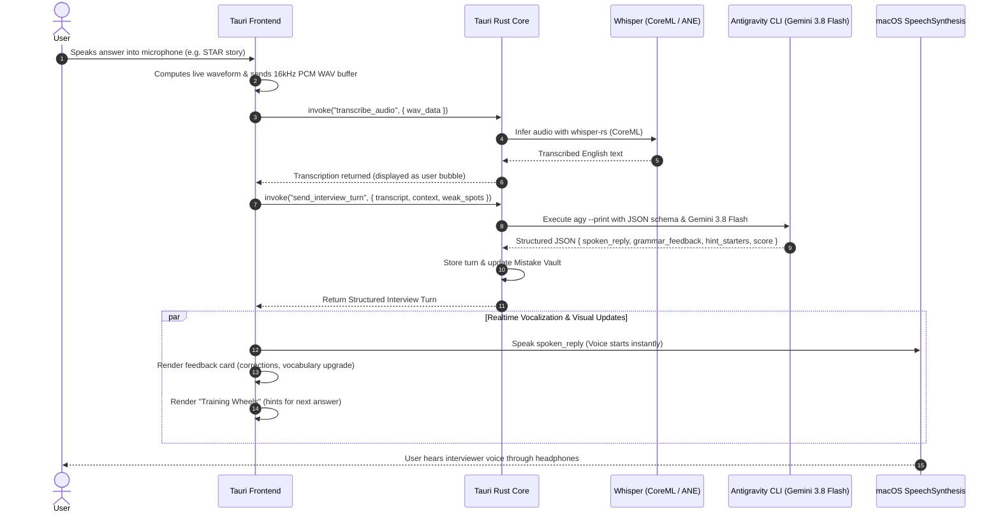
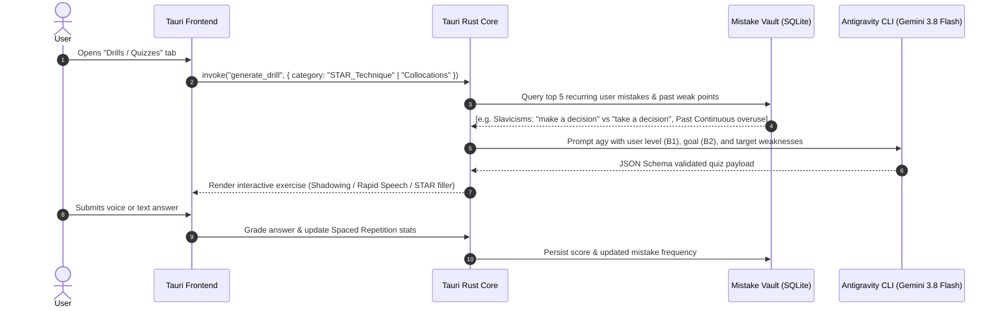

# System Architecture

This document describes the high-level architecture, component boundaries, and runtime data flows for the English Trainer desktop application.

---

## 1. High-Level Overview

English Trainer is a native macOS desktop application designed to bridge the gap between B1 (reading/listening comprehension) and B2 (fluent, spontaneous speaking for technical interviews).

The system consists of two primary runtime layers:
1. **Frontend (Presentation & Audio Capture):** Tauri WebView (React + Vite + Tailwind CSS + Shadcn/ui + TanStack Router). Captures microphone audio using the Web Audio API, renders real-time waveform visuals, and synthesizes speech via native macOS `SpeechSynthesis`.
2. **Backend (Core & ML Pipeline):** Tauri Rust layer. Executes local, hardware-accelerated speech-to-text (**Whisper CoreML** on Apple Neural Engine), interfaces with **Antigravity CLI** (`gemini-3.8-flash`) via structured JSON schema, and persists session history and vocabulary metrics locally.

```
┌────────────────────────────────────────────────────────────────────────┐
│                        Tauri Frontend (WebKit)                         │
│                                                                        │
│   ┌─────────────────────┐   ┌───────────────────┐   ┌──────────────┐   │
│   │ TanStack Router     │   │ Audio Waveform    │   │ macOS Native │   │
│   │ Views:              │   │ Visualizer        │   │ TTS Driver   │   │
│   │ - Voice Interview   │   │ (Web Audio API)   │   │ (Siri / Ava) │   │
│   │ - Rehearsal Chat    │   └─────────┬─────────┘   └───────▲──────┘   │
│   │ - STAR Drills       │             │                     │          │
│   │ - Mistake Vault     │             │ 16kHz PCM WAV       │ Spoken   │
│   └──────────┬──────────┘             │                     │ Text     │
└──────────────┼────────────────────────┼─────────────────────┼──────────┘
               │ Tauri IPC (invoke)     │                     │
┌──────────────▼────────────────────────▼─────────────────────┴──────────┐
│                         Tauri Backend (Rust)                           │
│                                                                        │
│  ┌────────────────────────┐  ┌──────────────────────────────────────┐  │
│  │ Audio & STT Engine     │  │ Antigravity CLI Controller (`agy`)   │  │
│  │ - whisper-rs + CoreML  │  │ - Command execution in scratch dir   │  │
│  │ - Apple Neural Engine  │  │ - Model: `gemini-3.8-flash-medium`   │  │
│  │ - Sub-200ms latency    │  │ - Strict JSON Schema enforcement     │  │
│  └────────────────────────┘  └──────────────────┬───────────────────┘  │
│                                                 │                      │
│  ┌──────────────────────────────────────────────▼───────────────────┐  │
│  │ Session & Mistake Vault (Local SQLite / JSON storage)             │  │
│  │ - Weakness profiling, B1->B2 metrics, Spaced Repetition queue     │  │
│  └──────────────────────────────────────────────────────────────────┘  │
└────────────────────────────────────────────────────────────────────────┘
```

---

## 2. Audio Pipeline: Zero Cloud Latency

A core problem with existing conversational AI apps is high latency (3–6 seconds roundtrip), which destroys the rhythm of natural speaking practice. English Trainer solves this by keeping all audio processing 100% on-device:

- **Speech-to-Text (STT):** User speech is captured via browser `MediaRecorder` or `AudioWorklet` as 16kHz mono WAV, passed over Tauri IPC to `whisper-rs`.
- **Apple Silicon Acceleration:** Whisper uses the CoreML backend compiled for Apple Neural Engine (ANE) on M1 Pro. The `base.en` model transcribes a 5-second sentence in ~150ms.
- **Text-to-Speech (TTS):** The assistant's text is voiced immediately by the browser's native `window.speechSynthesis` using high-definition macOS voices (*Ava*, *Samantha*, *Oliver*). Latency is ~0ms.

---

## 3. Data Flow & Sequence Diagrams

### 3.1 Voice Interview Loop

The user participates in a real-time vocal mock interview with dialogue assistance (hints, sentence starters).



### 3.2 Dynamic Exercise & Quiz Generation Loop

Gemini 3.8 Flash reads the user's persistent "Mistake Vault" and generates targeted B2 upgrade exercises.



---

## 4. Antigravity CLI Integration Architecture

The application communicates with the local Antigravity CLI (`agy`) following the proven pattern from `grind-test`:

1. **Isolation:** Every execution occurs in a dedicated temporary scratch directory (`/tmp/eng-trainer-agy-{uuid}`) to prevent `agy` from reading local repository workspace files.
2. **Schema Enforcement:** Calls use `--output-format json` and `--json-schema <path_to_schema>` to guarantee 100% deterministic deserialization in Rust via `serde`.
3. **Model Tiering:**
   - **Fast Tier (`gemini-3.8-flash-medium`):** Used for instant interview turns, rapid response drills, real-time grammar checks, and interactive quizzes.
   - **Smart Tier (`gemini-3.1-pro-high`):** Used for end-of-interview comprehensive performance reports, CV / resume deep alignment, and custom syllabus generation.
4. **Binary Resolution:** Resolves `agy` from environment override `ENG_TRAINER_AGY_BIN`, system `PATH`, or macOS standard directories (`~/.local/bin/agy`, `/opt/homebrew/bin/agy`, `/usr/local/bin/agy`).

---

## 5. Security & Privacy

- **100% Local Voice Processing:** Voice recordings are transcribed in memory via Apple Neural Engine; raw audio is never transmitted to any third-party cloud.
- **Transparent LLM Prompts:** Only the transcribed English text and anonymized conversation history are passed to Antigravity CLI.
- **Local Vault:** All user statistics, interview transcripts, and notes are kept in the local application support directory.
