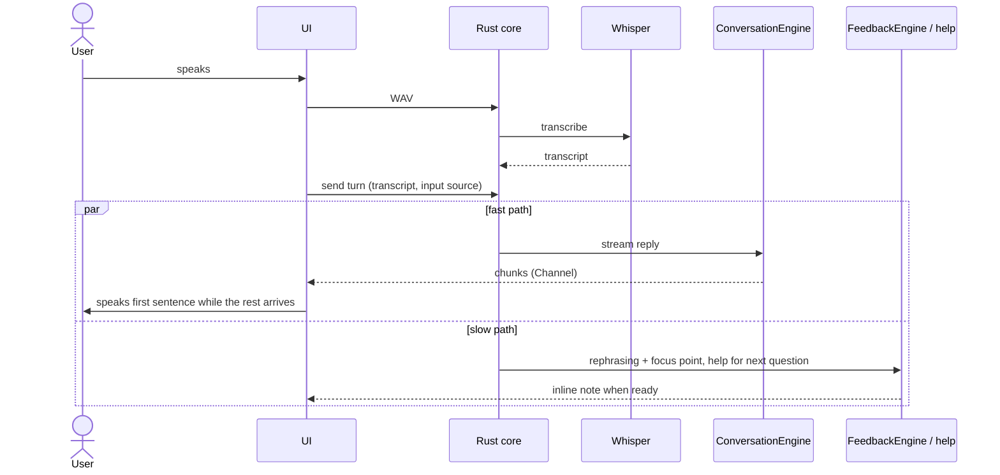

# Architecture

Runtime structure and boundaries. Each section states the **current** implementation and, where it
differs, the **target** that the roadmap feature named in brackets delivers.

## 1. Goals

1. **Low perceived latency:** end of learner speech → first AI audio under 2.5 s (p50).
2. **Conversation never waits for evaluation:** coaching, help and wrap-up run in parallel.
3. **Local first:** speech recognition, history and Learning Memory stay on the Mac.
4. **Replaceable providers:** product logic depends on engine traits, not on a model or CLI.

## 2. Overview

```text
┌──────────────────────── React UI (Tauri WebView) ────────────────────────┐
│ Talk screen · Learning Memory · Settings                                  │
│ Web Audio capture (PCM 16 kHz) · system TTS (speechSynthesis) · visuals   │
└───────────────┬──────────────────────────────────────────▲───────────────┘
                │ invoke() (typed)                         │ Channel (streamed chunks)
┌───────────────▼──────────────────────────────────────────┴───────────────┐
│ Rust core                                                                 │
│ conversation/  session orchestration, coaching, help, recall              │
│ learning/      normalisation, scheduling, usage and mastery rules         │
│ persistence/   SQLite (single connection behind a mutex)                  │
│ audio/         WAV validation, local Whisper                              │
│ providers/     ConversationEngine, FeedbackEngine, UsageReviewEngine      │
│ setup/         diagnostics for local dependencies                         │
└───────┬───────────────────────────┬──────────────────────────────────────┘
        │                           │
  Local Whisper              Conversation / evaluation providers
  (whisper.cpp)              Apple Foundation Models helper · Gemini API · agy (legacy)
```

## 3. Frontend

- **Routes:** `/` (home), `/conversation`, `/coach`, `/memory`, `/settings`, `/summary`. Interview,
  Drills and Progress are prototypes shown as unavailable. [F5] merges Conversation and Coach into
  one Talk route.
- **State:** `TrainerContext` holds the speech, capture and practice hooks shared by routes.
  Lifecycle states are discriminated unions (`captureView.ts`, `practiceState.ts`).
- **Shared audio** lives in `src/audio/` (recorder, device preference, signal diagnostics).
- **Feature dependencies** are one-way (`practice → conversation, coach, memory, speech`). The
  current `coach → practice` imports violate this and are removed in [F5].

## 4. Audio and speech recognition

Current:

```text
record (AudioWorklet, mono PCM, 16 kHz, browser voice processing off)
  → WAV in memory → invoke(raw bytes) → validate WAV
  → temp dir → spawn whisper-cli (ggml-base.en) → JSON → transcript → delete temp dir
```

Each recording waits for three seconds of input frames before the Recording state, to avoid a
quiet start observed on the MacBook microphone.

Target [F3]:

- one long-lived Whisper worker per app run keeps the model loaded (Metal);
- a larger English model chosen by measurement;
- initial prompt = current question + recent turns + personal glossary;
- the microphone stream opens once per session, so later answers start instantly;
- [F4] voice activity detection ends a turn after a configurable pause, with push-to-talk kept.

Raw audio is never written outside the temporary directory and is deleted after transcription.

## 5. Conversation vs evaluation



Current: the reply is generated whole and returned by `send_practice_turn`; feedback is requested
separately from the Coach flow. Target: [F1] streaming, [F2] sentence-level TTS, [F5] automatic
parallel coaching, [F6] prefetched help.

## 6. Providers

| Engine | Purpose | Current adapters | Target |
| :--- | :--- | :--- | :--- |
| `ConversationEngine` | Short spoken reply + one question | `agy` (process per turn, JSON schema, two attempts in 45 s); Apple helper (process per turn, structured output) | Streaming trait; Apple helper as a long-lived process with `prewarm()`; Gemini API over HTTPS streaming [F1] |
| `FeedbackEngine` | Rephrasing and focus points | `agy` | Gemini API [F5] |
| Guided answer | Model answer for the current question | `agy` | Gemini API, prefetched [F6] |
| `UsageReviewEngine` | Semantic check of phrase use | `agy` | Gemini API when touched; frozen otherwise |

Rules:

- Call sites choose a **tier** (conversation, coaching), not a model ID.
- Provider output is parsed into typed Rust values; invalid output is a recoverable typed error.
- Only transcript and the minimum prompt context leave the Mac. API keys live in the OS
  credential store (Keychain on macOS).
- `agy` runs only in a private temporary directory, never in the repository.

## 7. Learning engine

- Mistakes and phrase cards with review events and a simple interval schedule.
- Due items enter conversation context on selected turns (at most two targets).
- Spoken recall (daily recall and Memory review) records transcript evidence and updates the
  schedule atomically.
- An explicit usage review can assess the first two conversation answers against prior targets and
  maintain a multi-week mastery streak. This subsystem is frozen; rules in
  TECHNICAL_REQUIREMENTS §9.
- Input source (`voice`, `edited`, `text`) and cue exposure (help shown) are stored so cued or
  typed answers never count as independent spoken evidence.

## 8. Persistence

SQLite in the app data directory, one connection behind `Arc<Mutex<_>>`, migrations in
`persistence/schema.rs`. Provider calls run on blocking worker threads and never hold the lock.
Tables are listed in TECHNICAL_REQUIREMENTS §8.

## 9. Failure handling

- STT failure: the recording stays in memory for retry until reset; the session is untouched.
- Provider failure or timeout: the learner's answer stays editable and can be resent; nothing is
  saved for the failed turn.
- Coaching or help failure: the conversation continues.
- Missing dependency (Whisper, model, Apple model, API key): Settings shows the status and a
  recovery step; no crash.

## 10. Non-goals for the MVP

Screen or active-app monitoring, cloud speech recognition, a native Swift rewrite, menu-bar and
notification surfaces, WidgetKit, phoneme-level pronunciation scoring, multi-user features.
