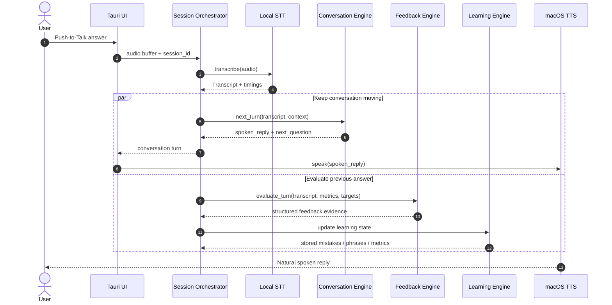
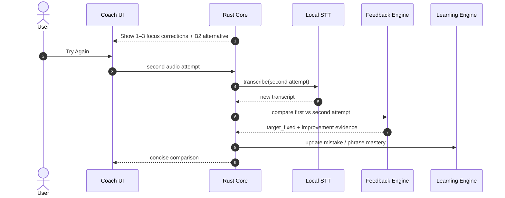
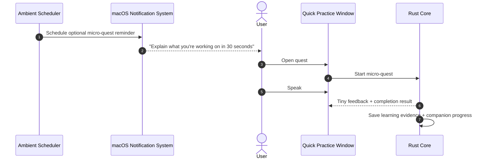

# System Architecture

This document describes the high-level architecture, component boundaries, runtime data flows, native macOS integration, and learning-system boundaries for the English Trainer desktop application.

---

## 1. Architectural Goals

The architecture should optimize for five things:

1. **Low-friction speaking practice** — the user should be able to start speaking quickly from the main app or menu bar.
2. **Low perceived conversation latency** — speech recognition, AI response generation, and TTS must feel like one continuous interaction.
3. **Separation of conversation from evaluation** — natural dialogue should not wait for deep grammar analysis.
4. **Local-first learning memory** — transcripts, metrics, mistakes, phrase reviews, benchmarks, and companion state remain on-device by default.
5. **Replaceable AI providers** — product logic must not depend directly on a specific Gemini model or CLI.

---

## 2. High-Level Overview

English Trainer is a native macOS desktop application built with Tauri v2.

The runtime is split into five logical layers:

1. **Presentation Layer** — React/Tauri WebView, main app screens, compact quick-practice window, waveform UI, and coaching cards.
2. **Application Core** — Rust orchestration for sessions, audio, provider calls, learning memory, metrics, scheduling, and persistence.
3. **AI Provider Layer** — adapter interfaces for conversation generation and language evaluation; Antigravity CLI is the initial implementation.
4. **Learning Engine** — evidence extraction, mistake/phrase memory, review scheduling, speaking-profile aggregation, and benchmark comparisons.
5. **macOS Companion Layer** — tray/menu-bar presence, autostart, notifications, global shortcut, and optional future WidgetKit extension.

```text
┌───────────────────────────────────────────────────────────────────────┐
│                         Tauri Frontend                                │
│                                                                       │
│ Main Window           Quick Practice Window       Tray / Menu Bar     │
│ ├─ Daily Practice     ├─ 20–90 sec quests         ├─ Mini Eva status  │
│ ├─ Conversation       ├─ Push-to-Talk             ├─ Speak now        │
│ ├─ Coach / Rehearsal  └─ Tiny feedback            └─ Open dashboard   │
│ ├─ Interview                                                     │
│ ├─ Learning Memory                                               │
│ └─ Progress                                                     │
└──────────────────────────────┬────────────────────────────────────────┘
                               │ Tauri IPC / Events
┌──────────────────────────────▼────────────────────────────────────────┐
│                           Rust Core                                  │
│                                                                      │
│ Session Orchestrator   Audio Engine       Ambient Scheduler           │
│ Learning Engine        Metrics Engine     Companion State             │
│ Provider Router        SQLite Repository  Notification Service        │
└──────────────┬──────────────────────┬───────────────────────┬─────────┘
               │                      │                       │
       ┌───────▼────────┐     ┌──────▼─────────┐     ┌──────▼─────────┐
       │ STT Provider   │     │ LLM Providers │     │ TTS Provider   │
       │ Local Whisper  │     │ Conversation  │     │ macOS system   │
       │ Metal/CoreML*  │     │ Evaluation    │     │ voices         │
       └────────────────┘     └──────┬─────────┘     └────────────────┘
                                     │
                             Antigravity CLI
                             (initial adapter)
```

`*` CoreML/ANE support is treated as an implementation spike to validate against the selected whisper.cpp / whisper-rs integration rather than assumed as a Cargo feature.

---

## 3. Product Runtime Surfaces

### 3.1 Main Window

The full application contains:

- Daily Practice;
- Conversation Mode;
- Coach / Rehearsal Mode;
- Interview Mode;
- Skill Builders;
- Learning Memory;
- Progress / Benchmarks;
- Settings.

### 3.2 Quick Practice Window

A compact Tauri window supports micro-practice without opening the full dashboard.

Example flow:

```text
Menu bar / notification / shortcut
  → compact prompt
  → Push-to-Talk
  → transcript
  → tiny response or correction
  → save result
  → close
```

The compact window should be optimized for interactions lasting approximately 20–90 seconds.

### 3.3 Menu Bar Companion

The application exposes a persistent tray/menu-bar item when Ambient Mode is enabled.

It can show:

- Mini Eva state;
- current learning focus;
- one due phrase;
- “Speak now”;
- “Give me a quest”;
- “Pause prompts today”;
- “Open English Trainer”.

Rich interaction is provided by the compact Tauri window rather than requiring a native Swift menu-bar UI in the MVP.

### 3.4 WidgetKit Extension — Later Phase

A native WidgetKit extension may later provide glanceable information on the macOS desktop and Notification Center:

- word / phrase of the moment;
- due review;
- daily speaking minutes;
- Mini Eva state;
- next micro-quest.

The widget is not responsible for the full recording flow. Interaction can deep-link into the compact practice window.

---

## 4. Audio Pipeline

### 4.1 Initial Recording Strategy

MVP input uses **Push-to-Talk** because it is predictable for a B1 learner who may pause while searching for words.

```text
Microphone
  → Web Audio capture
  → mono PCM/WAV buffer
  → Tauri IPC
  → local STT provider
  → transcript + timing metadata
```

### 4.2 Adaptive VAD — Later

Voice Activity Detection can be added after the manual flow is reliable.

The endpointing policy must tolerate thinking pauses:

```text
short silence      → continue listening
long silence       → possible end of turn
very long silence  → finalize turn
```

VAD thresholds should be configurable and should not treat every 500 ms hesitation as the end of a response.

### 4.3 STT Provider Boundary

The application core calls an abstraction instead of whisper-rs directly:

```rust
trait SpeechToTextProvider {
    async fn transcribe(&self, audio: AudioBuffer) -> Result<Transcript>;
}
```

Initial implementation:

```text
LocalWhisperProvider
  └─ whisper.cpp / whisper-rs integration
     ├─ Metal baseline
     └─ CoreML / ANE path if validated in the implementation spike
```

This keeps a future alternative STT engine possible without changing session logic.

---

## 5. Conversation vs Evaluation Pipeline

Conversation generation and coaching evaluation are intentionally separate jobs.

### 5.1 Fast Conversation Path

The fast path produces only what is required to keep the dialogue moving:

```text
Transcript
  → session context
  → ConversationEngine
  → short spoken reply / next question
  → TTS
```

### 5.2 Evaluation Path

The evaluation path analyzes the same completed user turn independently:

```text
Transcript + local speech metrics + learning targets
  → FeedbackEngine
  → structured evidence
     ├─ grammar corrections
     ├─ B1 → B2 upgrades
     ├─ useful phrases
     ├─ coherence notes
     ├─ recurring mistake candidates
     └─ speaking-dimension evidence
  → Learning Engine
  → SQLite
  → UI when appropriate
```

In Conversation Mode, evaluation can remain invisible until the review section.

In Coach Mode, the UI can surface the result after each turn.

---

## 6. Provider Architecture

Product code must not depend directly on `agy` or a specific model name.

### 6.1 Conversation Engine

```rust
trait ConversationEngine {
    async fn start_session(&self, request: StartSessionRequest)
        -> Result<ConversationTurn>;

    async fn next_turn(&self, request: ConversationRequest)
        -> Result<ConversationTurn>;
}
```

### 6.2 Feedback Engine

```rust
trait FeedbackEngine {
    async fn evaluate_turn(&self, request: FeedbackRequest)
        -> Result<TurnFeedback>;

    async fn evaluate_benchmark(&self, request: BenchmarkRequest)
        -> Result<BenchmarkEvaluation>;
}
```

### 6.3 Initial Adapter

```text
ConversationEngine
  └─ AntigravityConversationProvider

FeedbackEngine
  └─ AntigravityFeedbackProvider
```

The two interfaces may initially call the same model family, but they remain separate because latency, prompt design, schema size, and future model choice are different.

### 6.4 Future Adapters

Possible future implementations:

- local LLM;
- direct cloud API;
- different model for deep benchmark evaluation;
- offline fallback for basic drills.

---

## 7. Daily Practice Sequence



The architecture target is **low perceived latency**, not merely fast STT.

---

## 8. Re-Speaking Sequence



The second attempt should be stored as learning evidence, not merely another chat message.

---

## 9. Learning Engine

The Learning Engine owns long-term adaptation.

### 9.1 Responsibilities

- normalize feedback evidence;
- deduplicate recurring mistakes;
- track phrase mastery;
- schedule reviews;
- select due learning targets;
- aggregate local speech metrics;
- maintain the five speaking dimensions;
- compare benchmark sessions;
- update companion / quest progression.

### 9.2 Learning Target Selection

Suggested session composition:

```text
~70% natural session objective
~20% due mistakes / phrases
~10% stretch material
```

The percentages are heuristics.

The engine selects a small number of targets per session instead of injecting every frequent mistake into every AI turn.

### 9.3 Speaking Profile

The five profile dimensions are:

- Fluency;
- Accuracy;
- Range;
- Coherence;
- Interaction.

Scores are treated as internal trend indicators backed by evidence, not official CEFR certification.

---

## 10. Ambient Practice Architecture

### 10.1 Scheduler

`AmbientScheduler` reads:

- prompt frequency preferences;
- quiet hours;
- weekdays / weekends;
- due phrase queue;
- recent prompt history;
- current learning focus.

It then schedules a limited set of local micro-practice opportunities.

### 10.2 When the App Is Running in the Tray

The runtime can:

- select a quest dynamically;
- open the compact practice window;
- run STT / AI / TTS;
- update Mini Eva immediately.

### 10.3 When the App Is Not Running

The application must not assume that Rust code or the LLM can run while fully terminated.

Instead, macOS-scheduled local notifications can still remind the user. Selecting the notification launches the application / compact practice surface, after which the normal runtime pipeline begins.

### 10.4 Ambient Quest Flow



---

## 11. Mini Eva Companion Architecture

Mini Eva is a presentation of learning state, not a separate source of truth.

### 11.1 State Inputs

The companion can react to:

- speaking minutes;
- completed micro-quests;
- successful phrase recalls;
- re-speaking improvements;
- benchmark milestones;
- newly stabilized mistakes / phrases.

### 11.2 Stored State

Example:

```text
CompanionState
├─ level
├─ xp
├─ current_expression
├─ unlocked_cosmetics
├─ last_interaction_at
└─ active_quest_chain
```

No state decays because the user misses a day.

### 11.3 Separation Rule

Gamification never modifies language evaluation scores.

```text
Learning evidence → may award game progression
Game progression  → must not inflate learning evidence
```

---

## 12. macOS Integration

### 12.1 MVP Native Integration

Use Tauri-native capabilities where possible:

- tray/menu-bar icon;
- notification plugin;
- autostart plugin;
- optional global shortcut;
- compact secondary window.

### 12.2 Launch at Login

Ambient Mode may offer an explicit setting:

> Start English Trainer in the menu bar when I log in.

This must be user-controlled and reversible.

### 12.3 Notifications

Notification permission is requested only when the user enables proactive micro-practice.

Notifications should be scheduled conservatively and respect quiet hours.

### 12.4 Native Widget Extension

WidgetKit remains a separate optional Swift target / extension in a later phase because it adds native project complexity and should not block the Tauri MVP.

---

## 13. Persistence Model

SQLite is the primary local store.

Core entities:

```text
sessions
turns
speech_metrics
mistakes
phrase_cards
review_events
benchmarks
benchmark_dimension_results
ambient_quests
quest_events
companion_state
settings
```

Raw audio is ephemeral by default and does not need to be stored after transcription unless the user explicitly enables recording retention for pronunciation / review features.

---

## 14. Privacy & Security

### 14.1 Default Privacy Model

- raw microphone audio is processed locally;
- raw audio is discarded after transcription by default;
- learning history and statistics are local SQLite data;
- only the minimum text context required by the selected LLM provider is transmitted;
- Ambient Mode does not inspect screen contents or active applications;
- no Accessibility or Screen Recording permission is required for normal operation.

### 14.2 Provider Isolation

Antigravity CLI executions use isolated scratch directories.

The provider receives only the intended prompt/context payload and does not need access to the project workspace.

### 14.3 User Controls

Settings should include:

- delete session history;
- clear Learning Memory;
- disable transcript retention;
- disable Ambient Mode;
- disable launch at login;
- disable notifications;
- disable optional audio retention.

---

## 15. Latency & Observability

The primary product metric is:

> **End of user speech → beginning of AI speech**

Track at least:

- endpoint detection latency;
- STT latency;
- conversation-provider latency;
- TTS start latency;
- total perceived turn latency.

Suggested development targets:

```text
Perceived conversation latency:
  p50 < 1.5 s
  p95 < 3.0 s
```

These are product targets to validate on real hardware, not guarantees.

STT real-time factor and raw inference time should be recorded separately for diagnostics.

---

## 16. Failure Handling

The speaking loop should degrade gracefully.

Examples:

- STT failure → allow retry without losing session context;
- LLM timeout → short local error state and retry action;
- evaluation failure → continue conversation and evaluate later;
- TTS voice unavailable → fall back to another discovered English system voice;
- Antigravity CLI unavailable → show provider health status instead of crashing;
- notification permission denied → Ambient Mode continues through menu bar only.

Deep coaching must never be a hard dependency for continuing a conversation.

---

## 17. Architectural Non-Goals for MVP

The first version does not require:

- screen monitoring;
- active-application tracking;
- cloud audio transcription;
- native Swift rewrite of the application;
- WidgetKit extension;
- phoneme-level pronunciation scoring;
- social / multiplayer features;
- always-running privileged daemon.
