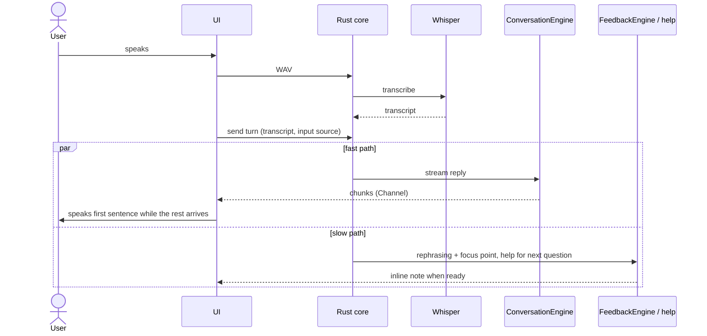

# Architecture

Runtime structure and boundaries. Each section states the **current** implementation and, where it
differs, the **target** that the roadmap feature named in brackets delivers.

## 1. Goals

1. **Low perceived latency:** end of learner speech → first AI audio under 2.5 s (p50).
2. **Conversation never waits for evaluation:** coaching, help and wrap-up run in parallel.
3. **Local first:** speech recognition, history and Learning Memory stay on the Mac.
4. **Replaceable providers:** product logic depends on engine traits, not on a model or CLI.

## 2. Overview

```text
┌──────────────────────── React UI (Tauri WebView) ────────────────────────┐
│ Talk screen · Learning Memory · Settings                                  │
│ Web Audio capture (PCM 16 kHz) · system TTS (speechSynthesis) · visuals   │
└───────────────┬──────────────────────────────────────────▲───────────────┘
                │ invoke() (typed)                         │ Channel (streamed chunks)
┌───────────────▼──────────────────────────────────────────┴───────────────┐
│ Rust core                                                                 │
│ conversation/  session orchestration, coaching queue, help, recall        │
│ learning/      normalisation, scheduling, usage and mastery rules         │
│ persistence/   SQLite (single connection behind a mutex)                  │
│ audio/         WAV validation, local Whisper                              │
│ providers/     conversation engines, batch coaching, UsageReviewEngine    │
│ setup/         diagnostics for local dependencies                         │
└───────┬───────────────────────────┬──────────────────────────────────────┘
        │                           │
  Local Whisper              Conversation / evaluation providers
  (whisper.cpp)              Apple Foundation Models helper · Gemini API · agy (coaching)
```

## 3. Frontend

- **Routes:** `/` (home), `/conversation` (the one Talk screen), `/memory`, `/settings`, `/summary`.
  The sidebar shows Talk, Memory and Settings.
- **State:** `TrainerContext` holds the speech, capture and practice hooks shared by routes.
  Lifecycle states are discriminated unions (`captureView.ts`, `practiceState.ts`).
- **Shared audio** lives in `src/audio/` (recorder, device preference, signal diagnostics).
- **Feature dependencies** are one-way (`practice → conversation, coach, memory, speech`). `coach`
  holds the presentational coaching note and imports no feature.

## 4. Audio and speech recognition

Current:

```text
record (AudioWorklet, mono PCM, 16 kHz, browser voice processing off)
  → WAV in memory → invoke(raw bytes) → validate WAV
  → POST to the whisper-server child (model kept loaded) → JSON → transcript
    (fallback: temp dir → spawn whisper-cli → JSON → transcript → delete temp dir)
```

`audio/server.rs` owns the `whisper-server` child process: one per app run for the chosen model,
bound to 127.0.0.1 on a free port, started when a practice session opens or on the first answer,
restarted once if it dies, replaced when the model changes, stopped on app exit (and, through a pid
note in the app data folder, after a crash). It is the only long-lived process on the speech path;
Rust builds the initial prompt (question, recent names, glossary) and the UI never talks to it.
While an answer is recorded, `transcribe_partial` re-runs the same loaded model on the audio so far
for the live transcript; the final transcription is separate.

Practice keeps one warm microphone session open (`audio/microphoneSession.ts`, owned by
`audio/microphoneManager.ts` and the `useMicrophoneSession` hook): the three-second input warm-up
that avoids the quiet start observed on the MacBook microphone happens once when the session opens,
not per answer. Recording starts at once with a 300 ms pre-roll, `audio/turnDetector.ts` ends a
turn after a pause, and `useSpeechCapture` falls back to a one-shot session where no warm one is
provided (recall drill, Settings test).

F3 part 2 built (awaiting a check in the app): the model is kept loaded by the `whisper-server`
child, `small.en` is the default when installed (chosen by measurement), the initial prompt is the
question + names from recent answers + the glossary, and a live transcript follows the learner
while they speak.

Raw audio is never written outside the temporary directory and is deleted after transcription.

## 5. Conversation vs evaluation



Current: the reply streams from `send_practice_turn`. Each saved answer joins a per-session coaching
queue in Rust; batches of up to five answers run in the background through `agy` and the notes appear
under the answers when a batch lands (`coaching-updated` event). Target: [F4] sentence-level TTS,
[F6] prefetched help.

## 6. Providers

| Engine | Purpose | Current adapters | Target |
| :--- | :--- | :--- | :--- |
| `ConversationEngine` | Short spoken reply + one question | Gemini API (HTTPS streaming, default); Apple helper (one long-lived process, `prewarm()`, streamed plain text); `agy` (legacy: process per turn, JSON schema, two attempts in 45 s) | Sentence-level speech from the stream [F4] |
| Batch coaching (`coach_answers`) | Rephrasing and one focus point per answer, up to five answers per call | `agy`, pinned to `gemini-3.8-flash-medium`; the Gemini API is not used (its free quota is reserved for conversation) | Same |
| Guided answer | Model answer for the current question | `agy` | Gemini API, prefetched [F6] |
| `UsageReviewEngine` | Semantic check of phrase use | `agy` | Gemini API when touched; frozen otherwise |

Rules:

- Call sites choose a **tier** (conversation, coaching), not a model ID. Every `agy` call names a
  Gemini model; `CliOptions.model` is mandatory and a test runs each entry point against a fake CLI.
- Provider output is parsed into typed Rust values; invalid output is a recoverable typed error.
- Only transcript and the minimum prompt context leave the Mac. API keys live in
  an encrypted, owner-only file in the app data folder, never in SQLite or logs.
- `agy` runs only in a private temporary directory, never in the repository.

## 7. Learning engine

- Mistakes and phrase cards with review events and a simple interval schedule.
- Due items enter conversation context on selected turns (at most two targets).
- Spoken recall (daily recall and Memory review) records transcript evidence and updates the
  schedule atomically.
- An explicit usage review can assess the first two conversation answers against prior targets and
  maintain a multi-week mastery streak. This subsystem is frozen; rules in
  TECHNICAL_REQUIREMENTS §9.
- Input source (`voice`, `edited`, `text`) and cue exposure (help shown) are stored so cued or
  typed answers never count as independent spoken evidence.

## 8. Persistence

SQLite in the app data directory, one connection behind `Arc<Mutex<_>>`, migrations in
`persistence/schema.rs`. Provider calls run on blocking worker threads and never hold the lock.
Tables are listed in TECHNICAL_REQUIREMENTS §8.

## 9. Failure handling

- STT failure: the recording stays in memory for retry until reset; the session is untouched.
- Provider failure or timeout: the learner's answer stays editable and can be resent; nothing is
  saved for the failed turn.
- Coaching or help failure: the conversation continues.
- Missing dependency (Whisper, model, Apple model, API key): Settings shows the status and a
  recovery step; no crash.

## 10. Non-goals for the MVP

Screen or active-app monitoring, cloud speech recognition, a native Swift rewrite, menu-bar and
notification surfaces, WidgetKit, phoneme-level pronunciation scoring, multi-user features.
