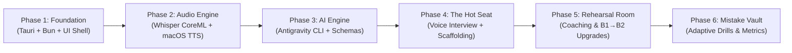

# Development Roadmap: English Trainer

This document outlines the phased development roadmap, milestone criteria, and deliverables for the English Trainer project.

---

## Phase Overview

---

## Detailed Phases & Deliverables

### Phase 1: Foundation & Project Skeleton
- [ ] Initialize Tauri v2 with `bun create tauri-app` (React 19, TypeScript, Vite).
- [ ] Configure Tailwind CSS v4, Lucide React, and Shadcn/ui theme tokens.
- [ ] Set up TanStack Router with code-based routes:
  - `/` (Dashboard & Quick Launch)
  - `/interview` (The Hot Seat — Voice Interview)
  - `/rehearsal` (The Rehearsal Room — Voice & Text Chat)
  - `/drills` (Skill Builders & Quizzes)
  - `/vault` (Mistake Vault & Progress Matrix)
  - `/settings` (Voice selection, Whisper model, Antigravity CLI path)
- [ ] Configure Biome linter & formatter adhering to the 300-line file limit rule.
- [ ] Add macOS entitlements and `Info.plist` permissions (`NSMicrophoneUsageDescription`).

### Phase 2: On-Device Audio Engine (Whisper CoreML + Native TTS)
- [ ] **Frontend Audio Capture:**
  - Web Audio API `AudioContext` (16,000 Hz, mono PCM WAV).
  - Canvas-based live audio waveform visualizer component.
- [ ] **Whisper CoreML Backend:**
  - Integrate `whisper-rs` with CoreML/Metal support in `src-tauri`.
  - Model bootstrap downloader for `ggml-base.en.bin` and CoreML weights.
  - Rust command `transcribe_audio(wav_bytes: Vec<u8>) -> Result<String, String>`.
- [ ] **macOS SpeechSynthesis Layer:**
  - TypeScript wrapper for `window.speechSynthesis` with automated voice discovery (*Ava*, *Samantha*, *Oliver*).
  - Speed, volume, and playback interruption controls.

### Phase 3: Antigravity CLI Bridge (`agy`)
- [ ] Implement `src-tauri/src/agy/mod.rs` based on the proven `grind-test` pattern:
  - Isolated temporary scratch directory per execution.
  - Command flags: `--print`, `--model gemini-3.8-flash-medium`, `--output-format json`, `--json-schema`.
  - Robust JSON envelope parser reading the last valid JSON chunk from stdout.
  - Fallback resolution for binary path (`ENG_TRAINER_AGY_BIN`, system `PATH`, `~/.local/bin/agy`, `/opt/homebrew/bin/agy`).
- [ ] Unit tests for `agy` execution with dummy JSON payloads.

### Phase 4: "The Hot Seat" — Voice Interviewer & Scaffolding
- [ ] Build the Voice Interview room UI:
  - Fullscreen, distraction-free voice mode.
  - Animated sound-wave pulse indicating AI speaking vs candidate speaking.
- [ ] **"Training Wheels" Scaffolding Panel:**
  - Live sentence starters (e.g. *"In my previous company, we faced..."*).
  - Recommended B2 vocabulary tags.
  - Visual 3-step STAR roadmap.
- [ ] End-to-end integration: User speaks → Whisper transcribes → Antigravity replies → macOS TTS vocalizes.

### Phase 5: "The Rehearsal Room" & Coaching Layer
- [ ] Build the Dual-Layer Chat interface:
  - Spoken bubble (interviewer response).
  - Coaching card below each turn:
    - Grammar corrections with brief explanations.
    - B1 → B2 vocabulary upgrades (e.g. *"I made it faster"* → *"I optimized latency"*).
    - Slavicisms / Russian-isms alerts (e.g. *"feel myself"*).
- [ ] "Re-record Turn" button allowing the user to immediately practice saying the corrected B2 version.

### Phase 6: "The Mistake Vault" & Adaptive Quizzes
- [ ] SQLite database setup in Rust (`rusqlite`):
  - `sessions`: Transcript history and overall interview scores.
  - `mistakes`: Recurring grammar slips, mispronounced words, and vocabulary gaps with frequency count and timestamps.
- [ ] **Adaptive Prompt Injection:**
  - Dynamic query injecting top recurring user mistakes into future interview prompts.
- [ ] **Skill Builders & Quizzes:**
  - Rapid 30-Second Elevator Pitch timer & evaluator.
  - Fill-in-the-blank Collocation quizzes targeting past mistakes.
  - STAR story structured builder.

---

## Definition of Done (DoD)
1. **Zero External Speech Latency:** Microphone input to transcription takes < 250ms on M1 Pro. TTS starts within 10ms of receiving the response.
2. **Deterministic Schemas:** 100% of Antigravity CLI responses conform to JSON schemas without deserialization panics.
3. **No Code Files > 300 Lines:** Strictly monitored and maintained.
4. **Adaptive Learning Verified:** Mistakes made in an interview session correctly populate the Mistake Vault and appear in subsequent drills.
