# Development Roadmap: English Trainer

This roadmap prioritizes usable learning loops over infrastructure completeness. Each phase should produce something that can be manually tested by speaking into the application.

---

## 1. Roadmap Principles

1. Build vertical slices early.
2. Validate the speaking experience before adding complex adaptive systems.
3. Keep conversation latency separate from deep coaching.
4. Add gamification only after the learning event model exists.
5. Treat WidgetKit and pronunciation scoring as later extensions, not MVP blockers.

---

## 2. Phase Overview

```mermaid
flowchart LR
    P0["Phase 0: Learning & Technical Spikes"] --> P1["Phase 1: Tauri Foundation"]
    P1 --> P2["Phase 2: Speech Vertical Slice"]
    P2 --> P3["Phase 3: First Usable Daily Practice"]
    P3 --> P4["Phase 4: Coaching + Re-Speaking"]
    P4 --> P5["Phase 5: Conversation + Interview Packs"]
    P5 --> P6["Phase 6: Learning Memory + Adaptation"]
    P6 --> P7["Phase 7: Ambient Practice + Nori"]
    P7 --> P8["Phase 8: Benchmarks + Progress"]
    P8 --> P9["Phase 9: Pronunciation + Native Widget"]
```



---

## Current Reality & Route to MVP (2026-10-02)

**MVP status: not ready for daily use.** The app has an app shell with Home, Conversation, Coach, and Learning Memory navigation. Home starts or resumes a saved session and shows a Learning Memory snapshot. Daily Practice guides an eight-answer conversation goal, optional Try Again, and up to three due-phrase spoken recall attempts after the goal. Dedicated Coach mode now persists its own four-answer sessions, saves each first answer before review, and asks the next question only after explicit Continue. Coach feedback and transcript-only retry evidence can be restored with the saved answer. The 10–15 minute duration is a suggestion, not a timer. Spoken wording matching is transcript evidence only; it does not change mastery. A broader language progress assessment is still missing. Physical-Mac end-to-end validation of both spoken loops remains open. The HTML and Markdown examples in `docs/ui/` remain design references, not exact implementation requirements.

The personal alpha adds filesystem-based setup diagnostics, shared system voice controls, an explicit synthetic AI response test, and installable Apple Silicon macOS packaging. Prototype Interview, Drills, and Progress destinations are unavailable in the alpha so sample results cannot appear as personal learning data. CLI/model detection does not certify authentication, transcription accuracy, GPU use, or microphone readiness. See [Personal Alpha setup](PERSONAL_ALPHA.md). New feature expansion is paused until several real practice sessions provide feedback.

### What is working so far

| Area | Current evidence | Still missing |
| :--- | :--- | :--- |
| Native speech path | The macOS app opened, recorded microphone audio, and ran local transcription. Automated audio, provider, and session tests pass. | A meaningful spoken conversation with reliable STT, voiced AI follow-up, coaching, and Try Again has not been verified end to end on a physical Mac. The exploratory microphone recording did not contain a useful learner answer. |
| Learning loop | Focused feedback, saved Try Again comparisons, SQLite mistakes and phrase cards, recall scheduling, and typed IPC exist as slices. Due items from earlier sessions can enter selected conversation prompts. After eight answers, Daily Practice can save transcript evidence for due-phrase spoken recall. Standalone Learning Memory voice review snapshots up to three due items with safe cues and saves local transcript evidence with schedule updates atomically. An explicit AI check can assess saved first-pass answers 1 and 2 in conversation sessions against up to three prior targets, save exact transcript evidence, reset status after supported relapse, and build an evidence-backed mastery streak across three distinct sessions and three weekly buckets spanning at least 21 days. | Automated or all-turn review, continuous conversational injection, semantic assessor calibration, a broader language progress assessment, and physical-Mac validation of spoken loops. Self-reported and cued recall must not count as spontaneous mastery. Physical microphone acceptance remains open. |
| Product UI | App shell and responsive Home / Conversation / Coach / Learning Memory navigation; Daily Practice dashboard, answer-based step guidance, due-phrase spoken recall, saved-evidence completion highlights, and a live due-item snapshot; dedicated Coach workspace with persisted answer review, explicit Continue, feedback, and transcript-only re-speaking comparison; Learning Memory workspace with standalone voice review (safe cue presentation, local recording/playback/transcription, transcript preview, atomic schedule save, wording-presence feedback, and resumable run lifecycle). HeroUI supplies dashboard controls and surfaces. The personal-alpha dashboard omits the prototype companion. | Physical-Mac validation of the Coach and Memory recall loops, timed stages, broader language progress assessment, expanded Settings, quick practice, and specialist screens. Search/category/status filters and the rest of the designed Memory screen remain open. The Lucide mascot has no companion state or learning-event reactions. |
| Ambient entry | None. | Tray quick launch, compact quick-practice window, opt-in notifications, and quiet-hour controls required by the MVP definition below. |

### Screen implementation inventory

| Designed surface | App state | MVP priority |
| :--- | :--- | :--- |
| [Daily Practice dashboard](ui/01_DAILY_PRACTICE_DASHBOARD.md) | Home supports start/resume, session status, and a live Learning Memory snapshot. The practice screen has answer-based step guidance, optional spoken due-phrase recall, and a saved-evidence completion screen. The suggested duration is not enforced; timed stages are not implemented. | Continue the daily flow |
| [Coach & Re-Speaking](ui/02_COACH_AND_RESPEAKING.md) and [Conversation](ui/03_CONVERSATION_MODE.md) | Conversation and dedicated Coach have separate persisted session modes. Coach saves each first answer before review, restores feedback and retry evidence, and waits for explicit Continue before generating the next prompt. | Physical-Mac validation before MVP |
| [Learning Memory](ui/06_LEARNING_MEMORY.md) | Panel for saved items and self-reported recall has a resumable voice review for up to three snapshotted due items. It hides underlying cards while active, presents safe cues, records and transcribes locally, and saves transcript wording evidence with schedule changes atomically. Spontaneous mastery transitions remain open. | Before MVP |
| [Settings](ui/08_SETTINGS_AND_HARDWARE.md) and [Ambient Quick Practice](ui/09_AMBIENT_COMPANION_QUICK_PRACTICE.md) | Settings shows actual detected CLI/model paths, shared system voices, an explicit AI response test, and local-data/privacy information. Microphone validation remains in the real recording flow. Ambient quick practice is absent. | Use personal alpha and validate speech before expanding Settings or adding ambient entry |
| [Interview](ui/04_THE_HOT_SEAT_INTERVIEW.md), [Drills](ui/05_SKILL_BUILDERS_DRILLS.md), [Progress](ui/07_PROGRESS_AND_BENCHMARKS.md) | Prototypes retained in source but unavailable in the personal alpha; no demo scores are shown as personal results. | After the core MVP loop |
| Session summary in the [navigation map](ui/NAVIGATION_MAP.md) | Finishing shows saved counts, a newly observed Try Again target when supported, the latest saved correction, and up to three phrase cards saved in that session. It makes no fluency or mastery claim. | Expand after real-session validation |

### Next implementation order

1. **Validate the spoken core loops:** on a physical Mac, check daily recall/interruption/resume/finish, dedicated Coach answer/review/Continue/restart behavior, and standalone Learning Memory voice recall drill recording/transcription/save flow. Keep microphone acceptance outstanding until these sessions produce useful transcripts and voiced follow-ups. Refine guided timing only after observing the experience.
2. **Review personal-alpha feedback before extending Learning Memory adaptation:** the first two saved first-pass conversation answers now have an explicit, optional AI review action. The current slice only credits exact transcript-grounded, high-confidence evidence from known targets and requires distinct sessions on separate days; `stable` additionally requires three seven-day buckets and 21 full days. Expand eligibility beyond answers 1 and 2 only after verifying that due prompts and other displayed cues cannot influence an answer. Semantic accuracy calibration and a physical-Mac usage-validation pass remain open.
3. **Add the MVP ambient subset:** menu-bar quick launch, compact 20–90 second practice, and opt-in local notifications with quiet hours. Leave Nori's learning-event state, benchmarks, interview packs, drills, WidgetKit, and pronunciation scoring for later.
4. **Run the MVP acceptance pass:** check every item in Section 14 through the built app, including privacy and repeated real-microphone sessions, before marking phases or MVP complete.

This order is the current delivery priority. The phase sections below remain the product requirements and exit criteria; their unchecked boxes should not be read as proof that no code exists, or changed to complete because a backend slice or prototype exists.

---

## 3. Phase 0 — Learning Model & Technical Spikes

### Goal

Remove the largest unknowns before building the product around them.

### Deliverables

- [ ] Finalize five speaking dimensions:
  - Fluency;
  - Accuracy;
  - Range;
  - Coherence;
  - Interaction.
- [ ] Define which metrics are deterministic/local and which require AI evaluation.
- [ ] Define baseline / benchmark task format.
- [ ] Define first Learning Memory entities.
- [ ] Prototype current Whisper integration on target Mac.
- [ ] Verify Metal path.
- [ ] Test CoreML / ANE path through selected whisper.cpp / whisper-rs build setup.
- [ ] Benchmark 2 s, 5 s, 15 s, and 30 s samples.
- [ ] Prototype Antigravity structured response with one small conversation schema.
- [ ] Prototype system TTS voice discovery.

### Exit Criteria

- local recording can be transcribed reliably;
- build strategy for Whisper is known;
- one structured AI response can be parsed into typed Rust;
- no architecture decision depends on an unverified `coreml` Cargo feature.

---

## 4. Phase 1 — Foundation & Project Skeleton

### Goal

Create the desktop shell and persistence boundaries.

Current state: Tauri, React, TypeScript, Vite, Bun, Tailwind, HeroUI, typed IPC, and SQLite migrations are present. The app shell uses TanStack Router for the working Home, Conversation, Coach, Memory, Settings, and summary destinations. Prototype destinations are unavailable in the personal alpha. The tray/window exit criteria remain open.

### Deliverables

- [ ] Initialize Tauri v2 + React 19 + TypeScript + Vite + Bun.
- [ ] Configure Tailwind CSS v4 and HeroUI.
- [ ] Configure TanStack Router.
- [ ] Configure strict TypeScript and Biome.
- [ ] Add microphone permission metadata.
- [ ] Add SQLite migrations.
- [ ] Create module boundaries:
  - `audio`;
  - `providers`;
  - `sessions`;
  - `learning`;
  - `persistence`;
  - `ambient`;
  - `gamification`.
- [ ] Add empty routes for Dashboard, Conversation, Rehearsal, Interview, Memory, Progress, Settings.
- [ ] Add tray/menu-bar icon with `Open` and `Quit`.

### Exit Criteria

- app launches on macOS;
- main and secondary windows can be created;
- DB migration runs successfully;
- tray can open the app.

---

## 5. Phase 2 — Speech Vertical Slice

### Goal

Prove the full local audio path before building learning logic.

### Deliverables

- [ ] Push-to-Talk recording.
- [ ] Web Audio / AudioWorklet PCM capture.
- [ ] Local STT provider.
- [ ] Transcript UI.
- [ ] Runtime system voice discovery.
- [ ] TTS playback controls.
- [ ] Basic latency instrumentation:
  - recording finalization;
  - STT;
  - TTS start.
- [ ] Audio error states and retry.

### User-Testable Flow

```text
Press → Speak → Release → See transcript → Hear it spoken back
```

### Exit Criteria

The user can complete this flow repeatedly without restarting the app.

---

## 6. Phase 3 — First Usable Daily Practice

### Goal

Create the first version worth using every day.

Current state: the Home dashboard offers a start/resume entry point, session status, a suggested 10–15 minute target, and a Learning Memory snapshot. Practice provides answer-based warm-up, conversation, optional Try Again, and due-phrase spoken recall guidance, plus a factual finish screen. It remains an open conversation without timed stages, and a full real-microphone acceptance pass is still required; this phase's exit criterion remains open.

### Deliverables

- [ ] `ConversationEngine` provider interface.
- [ ] Antigravity conversation adapter.
- [ ] Small fast conversation JSON schema.
- [ ] Session creation and turn persistence.
- [ ] AI question → user voice answer → AI spoken follow-up.
- [ ] Daily Practice flow with approximately 10 minutes of prompts.
- [ ] Conversation latency measurement:
  - end of speech → AI audio start.
- [ ] Basic scaffolding:
  - sentence starters;
  - optional target vocabulary.
- [ ] Manual Full / Partial / Off hint control.

### User-Testable Flow

```text
Open app → Start Daily Practice → Have a short spoken conversation → Finish session
```

### Exit Criteria

The developer/user can genuinely practice English with the app for several days without requiring the future features.

---

## 7. Phase 4 — Coaching & Re-Speaking

### Goal

Turn conversation into deliberate learning.

### Deliverables

- [ ] `FeedbackEngine` provider interface.
- [ ] Separate evaluation call from fast conversation response.
- [ ] Focused coaching card with maximum 1–3 priority items.
- [ ] Grammar correction.
- [ ] B1 → B2 rewrite.
- [ ] Useful phrase extraction.
- [ ] Slavicism / literal-translation detection when relevant.
- [ ] `Try Again` / re-record action.
- [ ] Compare first attempt with second attempt.
- [ ] Save improvement evidence.
- [ ] Rehearsal / Coach Mode UI.

### Exit Criteria

A user can make a mistake, understand the correction, immediately say the idea again, and receive evidence that the target was fixed.

---

## 8. Phase 5 — Conversation Modes & Interview Packs

### Goal

Broaden practice without changing the core speaking pipeline.

### Deliverables

#### General Conversation

- [ ] opinion prompts;
- [ ] storytelling;
- [ ] compare / contrast;
- [ ] explain a concept;
- [ ] polite disagreement;
- [ ] unexpected follow-ups.

#### Interview

- [ ] HR pack;
- [ ] Technical Deep-Dive pack;
- [ ] System Design pack;
- [ ] Behavioral / STAR pack.

#### Progressive Scaffolding

- [ ] Full Help;
- [ ] Partial Help;
- [ ] Rescue Only;
- [ ] Independent.

#### Skill Builders

- [ ] STAR vocalizer;
- [ ] 30-second pitch;
- [ ] paraphrase challenge;
- [ ] “explain it simpler” drill;
- [ ] quick collocation drill.

### Exit Criteria

The same core engine supports both general B1→B2 speaking and professional interview practice.

---

## 9. Phase 6 — Learning Memory & Adaptive Practice

### Goal

Make sessions remember the user and retest important weaknesses.

Current state: persistence, recall scheduling, a basic panel on its own navigation destination, a Home snapshot, bounded due-item prompt context, a limited saved-evidence session summary, and an explicit first-two-answer usage review slice (grounded quote evidence, relapse demotion, multi-week mastery progression, and Memory card evidence) are implemented as slices. The phase remains open because automatic or all-turn adaptation, continuous conversational injection, a complete recall experience, semantic assessor calibration, broader language assessment, physical microphone acceptance, and its exit criterion are not verified.

### Deliverables

- [ ] `mistakes` table and repository.
- [ ] `phrase_cards` table and repository.
- [ ] Review events.
- [ ] Mistake deduplication.
- [ ] Status lifecycle:
  - `new`;
  - `learning`;
  - `improving`;
  - `stable`;
  - `archived`.
- [ ] Simplified spaced repetition for phrases / discrete corrections.
- [ ] Track correct later usage.
- [ ] Session target selector using approximately 70/20/10 balance.
- [ ] Learning Memory screen.
- [ ] Session summary:
  - one improvement;
  - one focus;
  - 1–3 phrases.

### Exit Criteria

A mistake or phrase from one session can intentionally return in a later session and its mastery state can change based on real usage.

---

## 10. Phase 7 — Ambient Practice & Nori

### Goal

Make English practice feel lightweight, spontaneous, and game-like instead of requiring a single long study block.

Current state: the personal-alpha dashboard omits the prototype companion. Ambient entry, companion state, XP, and learning-event reactions are not implemented.

### 10.1 Menu-Bar Companion

- [ ] Expand tray actions:
  - Speak now;
  - Give me a quest;
  - Review one phrase;
  - Pause prompts today;
  - Open app.
- [ ] Add compact quick-practice Tauri window.
- [ ] Add global shortcut for quick speaking.

### 10.2 Ambient Scheduler

- [ ] Optional prompt frequency.
- [ ] Quiet hours.
- [ ] Weekday/weekend preferences.
- [ ] Local notifications.
- [ ] Daily prompt maximum.
- [ ] No repeated nagging after dismissal.
- [ ] Micro-quest history.

### 10.3 Micro-Quests

- [ ] “What are you working on?” — 30 s explanation.
- [ ] Quick opinion.
- [ ] Paraphrase challenge.
- [ ] Yesterday in three sentences.
- [ ] Explain a technical concept simply.
- [ ] Due phrase recall.
- [ ] One B1 → B2 phrase upgrade.

### 10.4 Nori v1

- [ ] Companion state model.
- [ ] XP from learning events.
- [ ] Expressions / simple visual states.
- [ ] Reactions to completed practice.
- [ ] Small milestone unlocks.
- [ ] No progress decay or punishment for missed days.

### Exit Criteria

The user can complete meaningful 20–90 second speaking practice from the menu bar without navigating through the full application.

---

## 11. Phase 8 — Baseline, Benchmarks & Progress

### Goal

Show evidence that speaking is improving over time.

### Deliverables

- [ ] Initial 8–12 minute baseline flow.
- [ ] Benchmark versioning.
- [ ] Local fluency metrics:
  - response latency;
  - pause metrics;
  - speech/pause ratio;
  - filler frequency;
  - speaking time.
- [ ] AI evidence for:
  - Accuracy;
  - Range;
  - Coherence;
  - Interaction.
- [ ] Combined Fluency evidence using local metrics + task result.
- [ ] Trend charts.
- [ ] First vs latest benchmark comparison.
- [ ] Evidence examples for score changes.
- [ ] Separate Interview Readiness view.

### Exit Criteria

The user can answer “What improved in my speaking over the last month?” using concrete trends and examples rather than a mysterious AI score.

---

## 12. Phase 9 — Advanced Pronunciation & Native Widget

These features are valuable but intentionally outside the MVP critical path.

### 12.1 Pronunciation Lab

- [ ] Evaluate forced-alignment options.
- [ ] Convert target text to phoneme representation.
- [ ] Align expected and spoken audio.
- [ ] Add stress/timing feedback.
- [ ] Validate scoring against real recordings.
- [ ] Keep Whisper transcription separate from phoneme scoring.

### 12.2 WidgetKit Extension

- [ ] Add native Swift WidgetKit target.
- [ ] Define shared snapshot/state mechanism.
- [ ] Show due phrase / current quest / Nori state.
- [ ] Deep-link into compact practice.
- [ ] Keep widget read-mostly and lightweight.

### Exit Criteria

Advanced features add value without becoming required dependencies for normal speaking sessions.

---

## 13. Testing Strategy by Phase

Testing should protect deterministic and high-risk logic without blocking early product iteration.

### Early

Prioritize:

- schema parsers;
- DB migrations;
- provider error handling;
- Learning Memory state changes;
- scheduler quiet-hour logic.

### After Core UX Stabilizes

Add:

- integration fixtures;
- key UI flows;
- regression recordings;
- end-to-end Daily Practice smoke tests.

Not every exploratory UI feature needs exhaustive automated coverage during the first iteration.

---

## 14. Definition of MVP

The MVP is complete when all of the following are true:

1. User can launch Daily Practice and speak naturally with the AI.
2. STT is local and reliable enough for normal English practice.
3. AI responses are voiced automatically.
4. Conversation feedback does not block the next spoken reply.
5. Coach Mode can show focused feedback.
6. User can re-speak an answer and compare attempts.
7. Sessions persist locally.
8. Basic Learning Memory retains mistakes / phrases.
9. Menu bar can launch a quick practice.
10. Optional notifications can invite short practice without notification spam.
11. Raw audio is not retained by default.
12. The app can be useful before WidgetKit, advanced pronunciation, and deep gamification are finished.

---

## 15. Post-MVP Decision Gates

Before investing heavily in later features, collect personal usage data for at least several weeks.

Useful questions:

- Do short micro-quests increase total speaking frequency?
- Does re-speaking get used or skipped?
- Which feedback categories are actually useful?
- Does Nori make practice more inviting or become visual noise?
- Are notifications useful at 1, 2, or 3 prompts per day?
- Does the user prefer long Daily Practice sessions or many micro-sessions?
- Which metrics correlate with the user feeling more fluent?

The roadmap should be adjusted using these observations rather than treating every later phase as mandatory.
