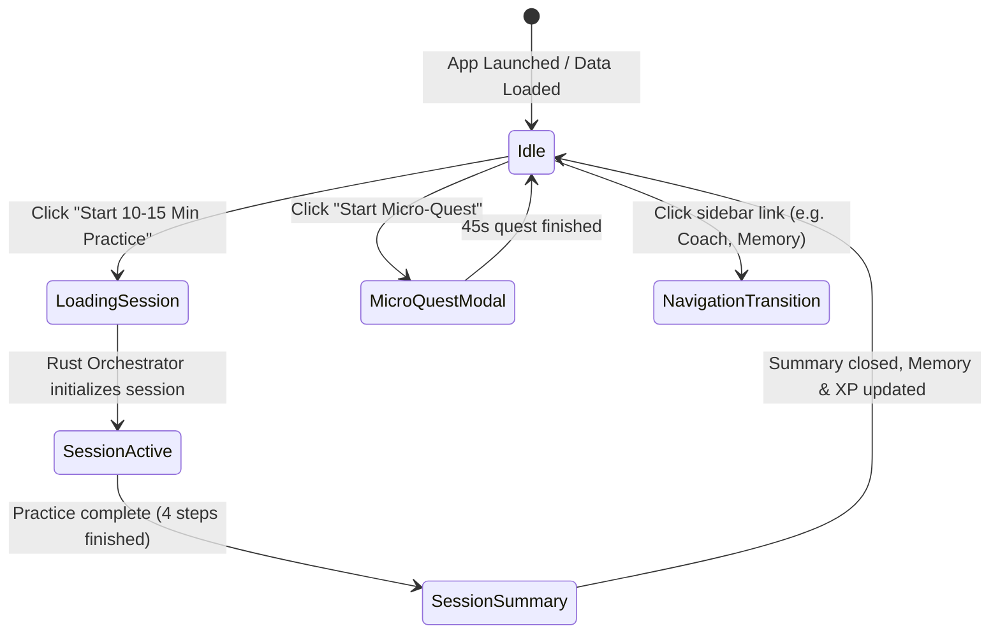

# Screen Prototype 01: Daily Practice Dashboard (`/`)

The Daily Practice Dashboard is the default landing screen for the English Trainer desktop app. It eliminates decision paralysis by providing a single, prominent **"Start 10–15 Minute Practice"** action that intelligently blends warm-up, conversational flow, re-speaking, and phrase recall.

---

## 1. Screen Objectives

1. **Zero-friction start**: The user does not need to configure scenarios, models, or settings before practicing. One click starts today's balanced session.
2. **Clear learning momentum**: Shows weekly speaking time, phrases due for spaced review, and Mini Eva's level & daily quest.
3. **Transparent session structure**: Shows what today's 10–15 minute session will consist of (70% conversational flow, 20% due weaknesses/phrases, 10% stretch material).
4. **Alternative mode access**: Easy secondary access to specialized modes (Conversation, Coach, Interview, Drills, Memory).

---

## 2. Visual Wireframe (ASCII Layout)

```text
┌──────────────────────────────────────────────────────────────────────────────────────────────────────────────────┐
│ 🔴 🟡 🟢  English Trainer                                       [ 🌱 Mini Eva: Level 3 (240 / 300 XP) ]  [ ⚙️ ] │
├─────────────────────────┬────────────────────────────────────────────────────────────────────────────────────────┤
│  NAVIGATION             │  MAIN CONTENT: Daily Practice Dashboard                                                │
│                         │                                                                                        │
│  🎙️ Practice (Active)    │  ┌─ HERO BANNER ─────────────────────────────────────────────────────────────────────┐ │
│  💬 Conversation        │  │  Good afternoon, Alex! 👋                                                         │ │
│  🎯 Coach Mode          │  │  Ready for today's spoken session? Today's focus: Trade-offs & Connectors.       │ │
│  💼 The Hot Seat        │  │                                                                                   │ │
│  ⚡ Drills              │  │  ┌──────────────────────────────────────────────────────────────────────────────┐ │ │
│  ─────────────────────  │  │  │  ▶️  Start 10–15 Min Practice                                                  │ │ │
│  🧠 Memory       [18]   │  │  └──────────────────────────────────────────────────────────────────────────────┘ │ │
│  📊 Progress            │  │  Recommended routine · 4 steps · ~12 minutes total                                │ │
│                         │  └───────────────────────────────────────────────────────────────────────────────────┘ │
│                         │                                                                                        │
│                         │  ┌─ TODAY'S SESSION BLUEPRINT ───────────────────────────────────────────────────────┐ │
│                         │  │  1. ☕ Warm-Up (1–2 min)    → "What took most of your attention today?"           │ │
│                         │  │  2. 💬 Dialogue (5–7 min)   → Technical trade-offs in recent projects             │ │
│                         │  │  3. 🎯 Re-Speaking (2–3 min)→ Fix 2 high-value answers with B2 collocations       │ │
│                         │  │  4. 🧠 Recall (1–2 min)     → 3 phrases due: "trade-off", "bottleneck", "on time" │ │
│                         │  └───────────────────────────────────────────────────────────────────────────────────┘ │
│                         │                                                                                        │
│                         │  ┌─ DASHBOARD WIDGETS (3-COLUMNS) ───────────────────────────────────────────────────┐ │
│                         │  │ ┌─ MINI EVA QUEST ───────┐ ┌─ LEARNING MEMORY ────┐ ┌─ WEEKLY SPEAKING ─────────┐ │ │
│                         │  │ │ 🧚 "Explain your lunch  │ │ 📚 18 items tracked   │ │ ⏱️  28 / 45 min target     │ │
│                         │  │ │     in 3 sentences"    │ │ 🔔 4 phrases due now  │ │    ████████░░░  62%       │ │
│                         │  │ │ [ Quick Quest (45s) ]  │ │ [ Review Flashcards ] │ │ 3-day active momentum     │ │
│                         │  │ └────────────────────────┘ └───────────────────────┘ └───────────────────────────┘ │ │
│                         │  └───────────────────────────────────────────────────────────────────────────────────┘ │
│                         │                                                                                        │
│                         │  ┌─ QUICK SPECIALIZED MODES ─────────────────────────────────────────────────────────┐ │
│                         │  │ [ 💬 Free Conversation ]  [ 🎯 Coach Mode ]  [ 💼 The Hot Seat ]  [ ⚡ Drills ]    │ │
│                         │  └───────────────────────────────────────────────────────────────────────────────────┘ │
├─────────────────────────┴────────────────────────────────────────────────────────────────────────────────────────┤
│ 🎙️ Mic: MacBook Pro Mic · Whisper: Base.en (Metal ⚡ 12ms)                      [ Press Space / PTT in Session ]│
└──────────────────────────────────────────────────────────────────────────────────────────────────────────────────┘
```

---

## 3. Component Hierarchy (HeroUI v3)

```text
DashboardView
├── AppSidebar (HeroUI Navigation / List)
│   ├── SidebarItem (Daily Practice - Selected)
│   ├── SidebarItem (Conversation)
│   ├── SidebarItem (Coach Mode)
│   ├── SidebarItem (The Hot Seat)
│   ├── SidebarItem (Drills)
│   ├── Divider
│   ├── SidebarItem (Memory, Badge: 18)
│   └── SidebarItem (Progress)
│
├── DashboardMain
│   ├── HeroBanner (Card)
│   │   ├── Card.Header: Greeting & Today's target Collocation/Topic
│   │   ├── Card.Body:
│   │   │   └── Button (size="lg", color="primary", startContent={<PlayIcon />})
│   │   │       "Start 10–15 Min Practice"
│   │   └── Card.Footer: Estimated time & format tag (Chip)
│   │
│   ├── SessionBlueprintCard (Card)
│   │   ├── Card.Header: "Today's Guided Session Plan"
│   │   └── Card.Body:
│   │       ├── StepItem (Step 1: Warm-up, Chip: "1-2 min")
│   │       ├── StepItem (Step 2: Core Topic, Chip: "5-7 min")
│   │       ├── StepItem (Step 3: Re-Speaking, Chip: "2-3 min", Badge: "High Value")
│   │       └── StepItem (Step 4: Due Recall, Chip: "1-2 min")
│   │
│   ├── QuickStatsRow (Grid 3 cols)
│   │   ├── MiniEvaWidget (Card)
│   │   │   ├── Avatar (Mini Eva mood / level 3)
│   │   │   ├── Progress (XP: 240/300)
│   │   │   └── Button (variant="flat", size="sm", "Start Micro-Quest")
│   │   │
│   │   ├── MemoryReviewWidget (Card)
│   │   │   ├── Chip (color="warning", "4 Due for Review")
│   │   │   └── Button (variant="light", size="sm", "Open Recall Queue")
│   │   │
│   │   └── SpeakingVolumeWidget (Card)
│   │       ├── Progress (value={62}, color="success")
│   │       └── Text ("28 / 45 min this week · 3-day momentum")
│   │
│   └── ModeShortcuts (ButtonGroup / Card Row)
│       ├── Button (variant="bordered", "💬 Free Conversation")
│       ├── Button (variant="bordered", "🎯 Coach Mode")
│       ├── Button (variant="bordered", "💼 The Hot Seat")
│       └── Button (variant="bordered", "⚡ Drills")
│
└── AudioStatusBar (Global Desktop Footer)
```

---

## 4. State Machine & Transitions



### State Definitions:
- `idle`: Displays daily greeting, blueprint, streak, and memory badges. Data loaded from local SQLite via Tauri IPC `get_daily_practice`.
- `loading_session`: Spinner on primary button while Tauri IPC calls `start_session(mode: 'daily_practice')`.
- `session_active`: Replaces dashboard with the guided step-by-step practice canvas.

---

## 5. HeroUI v3 + React Code Prototype

Below is the typed React 19 prototype component using HeroUI v3 compound components and Tailwind CSS v4:

```tsx
import React from 'react';
import {
  Card,
  Button,
  Chip,
  Progress,
  Avatar,
  Badge,
} from '@heroui/react';
import {
  Play,
  Sparkles,
  Brain,
  Clock,
  Mic,
  ArrowRight,
  Flame,
  MessageSquare,
  Crosshair,
  Briefcase,
  Zap,
} from 'lucide-react';

interface BlueprintStep {
  number: number;
  title: string;
  duration: string;
  description: string;
  icon: React.ReactNode;
  badge?: string;
}

export function DailyPracticeDashboard({
  onStartDailyPractice,
  onNavigate,
}: {
  onStartDailyPractice: () => void;
  onNavigate: (route: string) => void;
}) {
  const blueprintSteps: BlueprintStep[] = [
    {
      number: 1,
      title: 'Warm-up',
      duration: '1–2 min',
      description: 'Quick spontaneous reflection: "What took most of your attention today?"',
      icon: <Sparkles className="w-4 h-4 text-amber-500" />,
    },
    {
      number: 2,
      title: 'Conversation',
      duration: '5–7 min',
      description: 'Scenario: Explaining technical trade-offs & handling gentle follow-ups',
      icon: <MessageSquare className="w-4 h-4 text-blue-500" />,
    },
    {
      number: 3,
      title: 'Focused Re-Speaking',
      duration: '2–3 min',
      description: 'Upgrade 2 turns using B2 connectors ("whereas", "on the other hand")',
      icon: <Crosshair className="w-4 h-4 text-emerald-500" />,
      badge: 'Core Improvement',
    },
    {
      number: 4,
      title: 'Spaced Recall',
      duration: '1–2 min',
      description: 'Active voice retrieval for 3 due phrases: "trade-off", "bottleneck", "on schedule"',
      icon: <Brain className="w-4 h-4 text-purple-500" />,
    },
  ];

  return (
    <div className="flex flex-col gap-6 p-8 max-w-5xl mx-auto w-full">
      {/* Hero Action Banner */}
      <Card className="border border-neutral-200/60 dark:border-neutral-800 bg-gradient-to-br from-indigo-50/50 via-white to-neutral-50/50 dark:from-neutral-900 dark:via-neutral-900/90 dark:to-neutral-950 p-6 shadow-sm">
        <Card.Header className="flex flex-col items-start gap-1 pb-2">
          <div className="flex items-center gap-2">
            <Chip size="sm" color="primary" variant="flat" startContent={<Flame className="w-3.5 h-3.5" />}>
              Daily Focus: Fluency & Trade-offs
            </Chip>
            <Chip size="sm" variant="bordered">
              ~12 minutes total
            </Chip>
          </div>
          <h1 className="text-2xl font-bold tracking-tight text-neutral-900 dark:text-neutral-50 mt-2">
            Good afternoon! Ready for your speaking workout?
          </h1>
          <p className="text-sm text-neutral-600 dark:text-neutral-400">
            A balanced session with low-pressure speaking, targeted correction, and phrase retrieval.
          </p>
        </Card.Header>

        <Card.Body className="py-4">
          <Button
            size="lg"
            color="primary"
            className="w-full sm:w-auto font-semibold text-base px-8 h-12 shadow-md hover:shadow-lg transition-shadow"
            startContent={<Play className="w-5 h-5 fill-current" />}
            onPress={onStartDailyPractice}
          >
            Start 10–15 Min Practice
          </Button>
        </Card.Body>

        <Card.Footer className="pt-2 text-xs text-neutral-500 flex items-center gap-2">
          <Mic className="w-3.5 h-3.5 text-emerald-500" />
          <span>Push-to-Talk active (Spacebar) · Microphone ready · Local Whisper loaded</span>
        </Card.Footer>
      </Card>

      {/* Session Blueprint Section */}
      <Card className="border border-neutral-200/60 dark:border-neutral-800">
        <Card.Header className="flex justify-between items-center pb-2">
          <div>
            <h2 className="text-base font-semibold text-neutral-900 dark:text-neutral-100">
              Today's Guided Routine
            </h2>
            <p className="text-xs text-neutral-500">
              Adaptive breakdown: 70% Spontaneous speech · 20% Due memory · 10% Stretch
            </p>
          </div>
          <Chip size="sm" variant="flat" color="default">
            4 steps
          </Chip>
        </Card.Header>

        <Card.Body className="divide-y divide-neutral-100 dark:divide-neutral-800/60">
          {blueprintSteps.map((step) => (
            <div key={step.number} className="flex items-center justify-between py-3 first:pt-1 last:pb-1">
              <div className="flex items-center gap-3">
                <div className="w-8 h-8 rounded-full bg-neutral-100 dark:bg-neutral-800 flex items-center justify-center font-bold text-xs text-neutral-700 dark:text-neutral-300">
                  {step.number}
                </div>
                <div>
                  <div className="flex items-center gap-2">
                    <span className="font-medium text-sm text-neutral-800 dark:text-neutral-200">
                      {step.title}
                    </span>
                    {step.badge && (
                      <Chip size="sm" color="success" variant="flat" className="h-5 text-[10px]">
                        {step.badge}
                      </Chip>
                    )}
                  </div>
                  <p className="text-xs text-neutral-500 dark:text-neutral-400 mt-0.5">
                    {step.description}
                  </p>
                </div>
              </div>
              <div className="flex items-center gap-2">
                <Chip size="sm" variant="bordered" startContent={<Clock className="w-3 h-3 text-neutral-400" />}>
                  {step.duration}
                </Chip>
              </div>
            </div>
          ))}
        </Card.Body>
      </Card>

      {/* 3-Column Widgets: Mini Eva, Memory Due, Speaking Volume */}
      <div className="grid grid-cols-1 md:grid-cols-3 gap-4">
        {/* Widget 1: Mini Eva Companion */}
        <Card className="border border-neutral-200/60 dark:border-neutral-800 p-4">
          <Card.Header className="flex items-center gap-3 pb-2">
            <Avatar
              name="Eva"
              className="bg-purple-100 text-purple-700 dark:bg-purple-950 dark:text-purple-300 font-bold"
            />
            <div>
              <p className="font-semibold text-sm">Mini Eva · Level 3</p>
              <p className="text-xs text-neutral-500">240 / 300 XP (Momentum 🌱)</p>
            </div>
          </Card.Header>
          <Card.Body className="py-2">
            <Progress value={80} size="sm" color="secondary" aria-label="XP Progress" />
            <div className="mt-3 p-2 rounded-md bg-purple-50/60 dark:bg-purple-950/30 border border-purple-200/50 dark:border-purple-800/40">
              <p className="text-xs text-purple-900 dark:text-purple-300 font-medium">
                🎯 Micro-quest: "Describe yesterday in 3 sentences"
              </p>
            </div>
          </Card.Body>
          <Card.Footer className="pt-2">
            <Button size="sm" variant="flat" color="secondary" className="w-full text-xs">
              Quick Quest (45s)
            </Button>
          </Card.Footer>
        </Card>

        {/* Widget 2: Learning Memory Recall */}
        <Card className="border border-neutral-200/60 dark:border-neutral-800 p-4">
          <Card.Header className="flex justify-between items-center pb-2">
            <div className="flex items-center gap-2">
              <Brain className="w-4 h-4 text-indigo-500" />
              <span className="font-semibold text-sm">Learning Memory</span>
            </div>
            <Chip size="sm" color="warning" variant="flat">
              4 Due Now
            </Chip>
          </Card.Header>
          <Card.Body className="py-2">
            <p className="text-xs text-neutral-600 dark:text-neutral-400">
              18 total tracked mistakes & active phrase cards. 4 collocations need voice recall today.
            </p>
            <div className="mt-2 flex flex-wrap gap-1">
              <Chip size="sm" variant="bordered" className="text-[11px]">trade-off</Chip>
              <Chip size="sm" variant="bordered" className="text-[11px]">bottleneck</Chip>
              <Chip size="sm" variant="bordered" className="text-[11px]">+2 more</Chip>
            </div>
          </Card.Body>
          <Card.Footer className="pt-2">
            <Button
              size="sm"
              variant="flat"
              className="w-full text-xs"
              onPress={() => onNavigate('/memory')}
            >
              Open Memory Vault
            </Button>
          </Card.Footer>
        </Card>

        {/* Widget 3: Weekly Speaking Volume */}
        <Card className="border border-neutral-200/60 dark:border-neutral-800 p-4">
          <Card.Header className="flex justify-between items-center pb-2">
            <div className="flex items-center gap-2">
              <Clock className="w-4 h-4 text-emerald-500" />
              <span className="font-semibold text-sm">Weekly Speaking</span>
            </div>
            <span className="text-xs font-bold text-neutral-700 dark:text-neutral-300">
              28 / 45 min
            </span>
          </Card.Header>
          <Card.Body className="py-2">
            <Progress value={62} size="sm" color="success" aria-label="Speaking time progress" />
            <p className="text-xs text-neutral-500 dark:text-neutral-400 mt-3">
              🔥 3-day active streak. Re-speaking completion rate: <strong>85%</strong>.
            </p>
          </Card.Body>
          <Card.Footer className="pt-2">
            <Button
              size="sm"
              variant="flat"
              className="w-full text-xs"
              onPress={() => onNavigate('/progress')}
            >
              View Fluency Trends
            </Button>
          </Card.Footer>
        </Card>
      </div>

      {/* Direct Shortcuts to Other Modes */}
      <div className="flex flex-col gap-2 pt-2">
        <span className="text-xs font-medium text-neutral-500 uppercase tracking-wider">
          Or Jump Directly Into Specific Practice
        </span>
        <div className="grid grid-cols-2 sm:grid-cols-4 gap-3">
          <Button
            variant="bordered"
            className="justify-between h-12"
            onPress={() => onNavigate('/conversation')}
            endContent={<ArrowRight className="w-3.5 h-3.5 text-neutral-400" />}
          >
            <span className="text-xs font-medium">💬 Free Conversation</span>
          </Button>

          <Button
            variant="bordered"
            className="justify-between h-12"
            onPress={() => onNavigate('/rehearsal')}
            endContent={<ArrowRight className="w-3.5 h-3.5 text-neutral-400" />}
          >
            <span className="text-xs font-medium">🎯 Coach & Re-Speak</span>
          </Button>

          <Button
            variant="bordered"
            className="justify-between h-12"
            onPress={() => onNavigate('/interview')}
            endContent={<ArrowRight className="w-3.5 h-3.5 text-neutral-400" />}
          >
            <span className="text-xs font-medium">💼 The Hot Seat</span>
          </Button>

          <Button
            variant="bordered"
            className="justify-between h-12"
            onPress={() => onNavigate('/drills')}
            endContent={<ArrowRight className="w-3.5 h-3.5 text-neutral-400" />}
          >
            <span className="text-xs font-medium">⚡ Skill Drills</span>
          </Button>
        </div>
      </div>
    </div>
  );
}
```

---

## 6. Verification & IPC Contract

- **Tauri IPC Command**: `get_daily_practice(goal?: string) -> DailyPracticePlan`
- **Output Data Contract**:
  - `blueprint`: list of 4 phases (`warm_up`, `dialogue`, `re_speaking`, `recall`)
  - `mini_eva`: `{ level: number, xp: number, quest: string }`
  - `memory_summary`: `{ total_items: number, due_now: number, sample_due_phrases: string[] }`
  - `weekly_metrics`: `{ speaking_seconds: number, target_seconds: number, streak_days: number }`
- **User experience validation**:
  - Launching the app immediately answers "What should I practice today?"
  - Hitting spacebar or the primary button transitions directly into the warm-up step.
