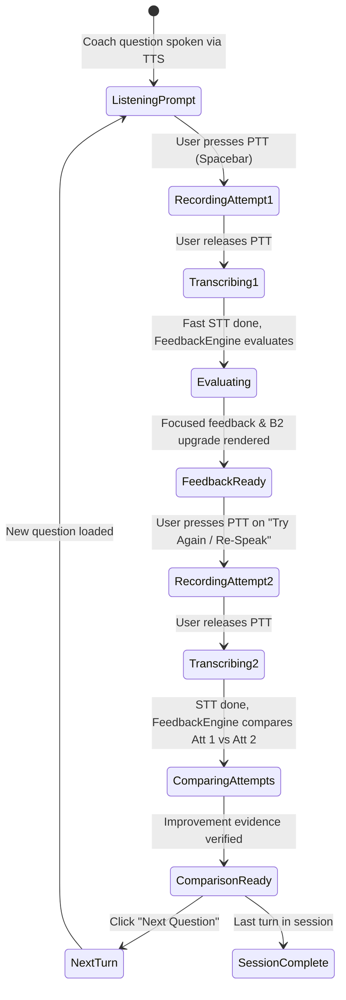

# Screen Prototype 02: Coach Mode & Re-Speaking (`/rehearsal`)

Coach Mode is the deliberate practice workshop of English Trainer. Unlike spontaneous Conversation Mode (where interruptions are minimized), Coach Mode executes the core learning loop on every turn:
**Speak → Focused Feedback (1–3 items) → B2 Upgrade → Speak Again (Re-Speaking) → Compare Attempts → Retain in Memory.**

---

## 1. Screen Objectives

1. **Focused Feedback, No Overwhelm**: Surface no more than 1–3 high-value corrections per turn (Grammar, Collocation, Slavicism/Literal translation).
2. **Actionable B2 Upgrade**: Always provide a natural, professional B2 phrasing of the user's exact idea.
3. **Immediate Re-Speaking Action**: A prominent **"Try Again"** Push-to-Talk action allows recording the second attempt immediately while the feedback is fresh in working memory.
4. **Evidence-Based Comparison**: Compare Attempt 1 vs Attempt 2 side-by-side to verify if the mistake was fixed, if latency improved, and if the target B2 vocabulary was adopted.
5. **Memory Stash**: 1-click option to save the corrected phrase or collocation into Learning Memory for spaced repetition.

---

## 2. Visual Wireframe (ASCII Layout)

```text
┌──────────────────────────────────────────────────────────────────────────────────────────────────────────────────┐
│ 🔴 🟡 🟢  English Trainer  >  Coach Mode                          [ 🌱 Mini Eva: Level 3 ]   [ ⚙️ Settings ]     │
├─────────────────────────┬────────────────────────────────────────────────────────────────────────────────────────┤
│  NAVIGATION             │  TOP BAR: Scenario: System Trade-offs · Turn 2 of 4                   [ End Session ]  │
│                         │                                                                                        │
│  🎙️ Practice            │  ┌─ COACH PROMPT ────────────────────────────────────────────────────────────────────┐ │
│  💬 Conversation        │  │  🤖 Coach Eva: "Why did your team decide to migrate from REST to gRPC for that   │ │
│  🎯 Coach Mode (Active) │  │                 internal service, and what was the downside?"                      │ │
│  💼 The Hot Seat        │  └───────────────────────────────────────────────────────────────────────────────────┘ │
│  ⚡ Drills              │                                                                                        │
│  ─────────────────────  │  ┌─ USER ATTEMPT 1 ──────────────────────────────────────────────────────────────────┐ │
│  🧠 Memory       [18]   │  │  🗣️ Your first answer · 18s · 1.4s start latency                                  │ │
│  📊 Progress            │  │  "We decided to use gRPC because it is more fast. But the minus was that          │ │
│                         │  │   it was very hard to debug for junior developers."                               │ │
│                         │  └───────────────────────────────────────────────────────────────────────────────────┘ │
│                         │                                                                                        │
│                         │  ┌─ FOCUSED FEEDBACK CARD (Max 2 items) ─────────────────────────────────────────────┐ │
│                         │  │  ⚠️ 1. Grammar: Comparative Degree                                                │ │
│                         │  │     Original: "more fast"  →  Better: "faster" / "significantly faster"           │ │
│                         │  │                                                                                   │ │
│                         │  │  🇺🇦 2. Slavicism / Natural Collocation Alert                                       │ │
│                         │  │     Original: "the minus was that..."                                             │ │
│                         │  │     B2 Upgrade: "the main drawback was..." or "the trade-off was..."              │ │
│                         │  │     Explanation: In English, "the minus" sounds literal. Native speakers prefer   │ │
│                         │  │                  "drawback", "trade-off", or "downside".                          │ │
│                         │  │                                                                                   │ │
│                         │  │  ⭐ Recommended B2 Phrasing to Re-Speak:                                          │ │
│                         │  │  "We switched to gRPC because it was significantly faster, though the main        │ │
│                         │  │   drawback was the steep learning curve for junior developers."                   │ │
│                         │  └───────────────────────────────────────────────────────────────────────────────────┘ │
│                         │                                                                                        │
│                         │  ┌─ RE-SPEAKING WORKBENCH (Attempt 2) ───────────────────────────────────────────────┐ │
│                         │  │  [ 🎙️ Hold Space to Re-Speak Your Answer (Target: 'drawback' + 'faster') ]         │ │
│                         │  │                                                                                   │ │
│                         │  │  ✓ ATTEMPT 2 RECORDED:                                                            │ │
│                         │  │  "We decided to use gRPC because it was significantly faster. However, the main   │ │
│                         │  │   drawback was that it was harder to debug for junior developers."                │ │
│                         │  │                                                                                   │ │
│                         │  │  🎉 Improvement Verified:                                                         │ │
│                         │  │  • Target Fixed: Slavicism replaced with "main drawback" (+20 XP)                 │ │
│                         │  │  • Target Fixed: "significantly faster" used correctly                            │ │
│                         │  │  • Latency: Start pause dropped from 1.4s → 0.6s                                  │ │
│                         │  │                                                                                   │ │
│                         │  │  [ ⭐ Save 'the main drawback' to Memory ]  [ Continue to Next Turn ➔ ]           │ │
│                         │  └───────────────────────────────────────────────────────────────────────────────────┘ │
├─────────────────────────┴────────────────────────────────────────────────────────────────────────────────────────┤
│ 🎙️ PTT Active · Audio buffer: Mono 16kHz PCM · Local Whisper Base.en (18ms)      [ Press and hold Space to Speak ]│
└──────────────────────────────────────────────────────────────────────────────────────────────────────────────────┘
```

---

## 3. Component Hierarchy (HeroUI v3)

```text
CoachModeView
├── AppSidebar
└── CoachCanvas
    ├── CanvasHeader
    │   ├── Breadcrumb / ModeTitle
    │   ├── TurnCounter (Chip: "Turn 2 of 4")
    │   └── FinishSessionButton (Button variant="light")
    │
    ├── CoachPromptCard (Card)
    │   ├── Avatar (Coach Persona)
    │   ├── Text (Question / Prompt)
    │   └── AudioReplayButton (Button isIconOnly variant="flat")
    │
    ├── UserAttempt1Card (Card)
    │   ├── Header: "Your First Attempt" + TimingChip ("18s · 1.4s pause")
    │   └── Body: Spoken Transcript with highlighted mistake spans
    │
    ├── FocusedFeedbackCard (Card)
    │   ├── Header: FocusAlert ("2 high-value improvements found")
    │   ├── FeedbackItemsList
    │   │   ├── FeedbackItem (Chip: "Grammar", diff: "more fast" → "faster")
    │   │   └── FeedbackItem (Chip: "Slavicism", diff: "the minus" → "the main drawback", Accordion for explanation)
    │   └── B2UpgradeQuote (Snippet or Callout with speaker audio preview)
    │
    ├── ReSpeakingWorkbench (Card)
    │   ├── PushToTalkArea (Button size="lg" color="success" - Re-speak prompt)
    │   └── AttemptComparisonSection (Conditional on Attempt 2 completion)
    │       ├── ComparisonHeader (Chip color="success": "Target Fixed!")
    │       ├── SideBySideTextDiff
    │       ├── MetricsDelta (Latency delta, pause delta)
    │       └── ActionButtonsRow
    │           ├── Button (variant="bordered", startContent={<BookmarkIcon />}, "Save phrase to Memory")
    │           └── Button (color="primary", endContent={<ArrowRightIcon />}, "Next Question")
    │
    └── AudioStatusBar (Persistent Footer)
```

---

## 4. State Machine for a Coach Turn



---

## 5. HeroUI v3 + React Code Prototype

Below is the typed React 19 prototype component for Coach & Re-Speaking using HeroUI v3 compound components and Lucide icons:

```tsx
import React, { useState } from 'react';
import {
  Card,
  Button,
  Chip,
  Accordion,
  Progress,
  Avatar,
  Tooltip,
} from '@heroui/react';
import {
  Mic,
  Volume2,
  CheckCircle2,
  AlertTriangle,
  Sparkles,
  ArrowRight,
  BookmarkPlus,
  RefreshCw,
  Clock,
  Zap,
} from 'lucide-react';

interface FeedbackItem {
  id: string;
  category: 'grammar' | 'slavicism' | 'vocabulary' | 'coherence';
  title: string;
  original: string;
  replacement: string;
  explanation: string;
}

export function CoachAndReSpeaking() {
  const [turnState, setTurnState] = useState<
    'prompt' | 'attempt1_recorded' | 'feedback_ready' | 'attempt2_recorded'
  >('feedback_ready');

  const feedbackItems: FeedbackItem[] = [
    {
      id: '1',
      category: 'grammar',
      title: 'Comparative Degree',
      original: 'more fast',
      replacement: 'faster / significantly faster',
      explanation: 'One-syllable adjectives form the comparative with -er, not "more".',
    },
    {
      id: '2',
      category: 'slavicism',
      title: 'Literal Slavicism: "the minus"',
      original: 'the minus was that...',
      replacement: 'the main drawback was that...',
      explanation:
        'In Russian/Ukrainian, "минус" is commonly used for a disadvantage. In natural English, use "drawback", "downside", or "trade-off".',
    },
  ];

  return (
    <div className="flex flex-col gap-5 p-8 max-w-4xl mx-auto w-full">
      {/* Top Bar Context */}
      <div className="flex items-center justify-between border-b border-neutral-200 dark:border-neutral-800 pb-3">
        <div className="flex items-center gap-3">
          <Chip size="sm" variant="flat" color="primary">
            Coach Mode · Turn 2 of 4
          </Chip>
          <span className="text-xs text-neutral-500">Scenario: Technical Architecture & Trade-offs</span>
        </div>
        <Button size="sm" variant="light" color="danger" className="text-xs">
          End Session Early
        </Button>
      </div>

      {/* 1. Coach Prompt */}
      <Card className="border border-neutral-200/80 dark:border-neutral-800 bg-neutral-50/50 dark:bg-neutral-900/50 p-4">
        <div className="flex items-start gap-3">
          <Avatar name="Eva" className="bg-indigo-600 text-white font-semibold text-xs mt-1" />
          <div className="flex-1">
            <div className="flex items-center justify-between">
              <span className="text-xs font-semibold text-neutral-600 dark:text-neutral-400">
                Coach Eva
              </span>
              <Button isIconOnly size="sm" variant="light" aria-label="Replay audio">
                <Volume2 className="w-4 h-4 text-neutral-500" />
              </Button>
            </div>
            <p className="text-sm font-medium text-neutral-900 dark:text-neutral-100 mt-1 leading-relaxed">
              “Why did your team decide to migrate from REST to gRPC for that internal service, and
              what was the main downside?”
            </p>
          </div>
        </div>
      </Card>

      {/* 2. User Attempt 1 */}
      <Card className="border border-neutral-200 dark:border-neutral-800 p-4">
        <Card.Header className="flex justify-between items-center pb-2">
          <div className="flex items-center gap-2">
            <span className="text-xs font-semibold uppercase tracking-wider text-neutral-500">
              Your First Attempt
            </span>
          </div>
          <div className="flex items-center gap-2">
            <Chip size="sm" variant="bordered" startContent={<Clock className="w-3 h-3 text-neutral-400" />}>
              18s
            </Chip>
            <Chip size="sm" variant="bordered" color="warning">
              1.4s start latency
            </Chip>
          </div>
        </Card.Header>
        <Card.Body className="pt-1 pb-2">
          <p className="text-sm text-neutral-700 dark:text-neutral-300 leading-relaxed">
            “We decided to use gRPC because it is{' '}
            <span className="underline decoration-amber-500 decoration-2 font-medium bg-amber-50/50 dark:bg-amber-950/40 px-1 rounded">
              more fast
            </span>
            . But{' '}
            <span className="underline decoration-red-500 decoration-2 font-medium bg-red-50/50 dark:bg-red-950/40 px-1 rounded">
              the minus was that
            </span>{' '}
            it was very hard to debug for junior developers.”
          </p>
        </Card.Body>
      </Card>

      {/* 3. Focused Feedback Card (Max 1–3 items) */}
      <Card className="border-2 border-indigo-500/20 dark:border-indigo-500/30 bg-indigo-50/20 dark:bg-indigo-950/10 p-5 shadow-sm">
        <Card.Header className="flex items-center justify-between pb-3">
          <div className="flex items-center gap-2">
            <Sparkles className="w-4 h-4 text-indigo-500" />
            <h3 className="text-sm font-bold text-neutral-900 dark:text-neutral-100">
              Targeted Feedback (2 high-value corrections)
            </h3>
          </div>
          <Chip size="sm" color="primary" variant="flat">
            B1 → B2 Upgrade
          </Chip>
        </Card.Header>

        <Card.Body className="flex flex-col gap-3 py-1">
          {feedbackItems.map((item) => (
            <div
              key={item.id}
              className="p-3 rounded-lg bg-white dark:bg-neutral-900 border border-neutral-200/80 dark:border-neutral-800"
            >
              <div className="flex items-center justify-between">
                <span className="text-xs font-semibold text-neutral-800 dark:text-neutral-200">
                  {item.title}
                </span>
                <Chip
                  size="sm"
                  color={item.category === 'slavicism' ? 'danger' : 'warning'}
                  variant="flat"
                  className="text-[10px] h-5"
                >
                  {item.category.toUpperCase()}
                </Chip>
              </div>

              <div className="flex items-center gap-2 mt-2 text-xs">
                <span className="line-through text-neutral-400">{item.original}</span>
                <ArrowRight className="w-3 h-3 text-neutral-400" />
                <span className="font-semibold text-emerald-600 dark:text-emerald-400">
                  {item.replacement}
                </span>
              </div>

              <p className="text-xs text-neutral-500 dark:text-neutral-400 mt-2 leading-relaxed">
                {item.explanation}
              </p>
            </div>
          ))}

          {/* Stronger B2 Formulation for Re-speaking */}
          <div className="mt-2 p-3.5 rounded-lg bg-emerald-50/60 dark:bg-emerald-950/30 border border-emerald-200/60 dark:border-emerald-800/40">
            <span className="text-xs font-bold text-emerald-800 dark:text-emerald-300 block mb-1">
              ✨ Stronger B2 Model Answer to Re-Speak:
            </span>
            <p className="text-xs text-emerald-950 dark:text-emerald-100 italic leading-relaxed">
              “We opted for gRPC because it was{' '}
              <strong className="underline">significantly faster</strong>. However, the{' '}
              <strong className="underline">main drawback</strong> was the steeper learning curve
              when debugging for junior developers.”
            </p>
          </div>
        </Card.Body>
      </Card>

      {/* 4. Re-Speaking Workbench */}
      <Card className="border border-emerald-500/40 bg-gradient-to-br from-white to-emerald-50/20 dark:from-neutral-900 dark:to-emerald-950/20 p-5">
        <Card.Header className="flex justify-between items-center pb-2">
          <div className="flex items-center gap-2">
            <RefreshCw className="w-4 h-4 text-emerald-600" />
            <h3 className="text-sm font-bold text-neutral-900 dark:text-neutral-100">
              Re-Speaking: Speak the Corrected Idea Now
            </h3>
          </div>
          <span className="text-xs text-neutral-500">Target words: "faster", "main drawback"</span>
        </Card.Header>

        <Card.Body className="py-3 flex flex-col items-center justify-center gap-3">
          <p className="text-xs text-neutral-600 dark:text-neutral-400 text-center max-w-md">
            Say your answer again with the corrections. Your second attempt will be compared with
            your first.
          </p>

          <Button
            size="lg"
            color="success"
            className="font-semibold text-white px-8 h-12 shadow-md hover:shadow-lg transition-all"
            startContent={<Mic className="w-5 h-5 fill-current" />}
            onPress={() => setTurnState('attempt2_recorded')}
          >
            Hold Space to Re-Speak
          </Button>
        </Card.Body>

        {/* If Attempt 2 has been recorded, show Comparison Diff */}
        {turnState === 'attempt2_recorded' && (
          <div className="mt-4 pt-4 border-t border-neutral-200 dark:border-neutral-800 flex flex-col gap-3">
            <div className="flex items-center justify-between">
              <div className="flex items-center gap-2">
                <CheckCircle2 className="w-4 h-4 text-emerald-600" />
                <span className="text-xs font-bold text-emerald-700 dark:text-emerald-400">
                  Attempt 2 Evidence: Both Targets Successfully Fixed!
                </span>
              </div>
              <Chip size="sm" color="success" variant="flat">
                +25 XP Awarded
              </Chip>
            </div>

            <div className="p-3 rounded-lg bg-neutral-50 dark:bg-neutral-950 border border-neutral-200 dark:border-neutral-800 text-xs">
              <p className="text-neutral-800 dark:text-neutral-200 leading-relaxed">
                “We chose gRPC because it was{' '}
                <span className="text-emerald-600 dark:text-emerald-400 font-bold">significantly faster</span>
                . However, the{' '}
                <span className="text-emerald-600 dark:text-emerald-400 font-bold">main drawback</span>{' '}
                was that junior engineers struggled with debugging.”
              </p>
            </div>

            <div className="grid grid-cols-2 gap-2 text-xs">
              <div className="p-2 rounded bg-neutral-100 dark:bg-neutral-800 flex justify-between">
                <span className="text-neutral-500">Start hesitation:</span>
                <span className="font-semibold text-emerald-600">1.4s → 0.6s (-57%)</span>
              </div>
              <div className="p-2 rounded bg-neutral-100 dark:bg-neutral-800 flex justify-between">
                <span className="text-neutral-500">Slavicism eliminated:</span>
                <span className="font-semibold text-emerald-600">Yes (drawback)</span>
              </div>
            </div>

            {/* Action Row */}
            <div className="flex items-center justify-between pt-2">
              <Button
                size="sm"
                variant="bordered"
                startContent={<BookmarkPlus className="w-3.5 h-3.5 text-indigo-500" />}
                className="text-xs"
              >
                Save "the main drawback" to Memory
              </Button>

              <Button
                size="sm"
                color="primary"
                endContent={<ArrowRight className="w-3.5 h-3.5" />}
                className="text-xs font-semibold"
              >
                Continue to Turn 3
              </Button>
            </div>
          </div>
        )}
      </Card>
    </div>
  );
}
```

---

## 6. Verification & IPC Contract

- **Evaluation IPC Command**: `get_turn_feedback(turn_id: string) -> TurnFeedback`
- **Re-Speaking IPC Command**: `retry_turn(turn_id: string, audio_bytes: Uint8Array) -> AttemptComparison`
- **Comparison Payload**:
  - `target_fixed`: `boolean` (e.g. `true`)
  - `improvements`: `string[]` (e.g. `["Replaced 'more fast' with 'significantly faster'", "Used 'main drawback' instead of 'the minus'"]`)
  - `hesitation_delta_ms`: `number` (e.g. `-800`)
  - `recommended_action`: `'accept' | 'retry' | 'save_phrase'`
