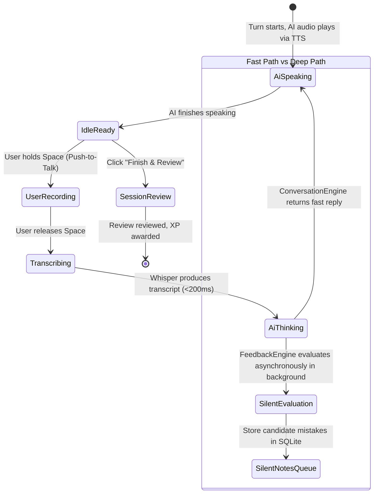

# Screen Prototype 03: Conversation Mode (`/conversation`)

Conversation Mode is the fluency workshop of English Trainer. While Coach Mode interrupts every turn to dissect grammar and vocabulary, Conversation Mode optimizes for **spontaneous interaction, psychological safety, and conversational rhythm**.

---

## 1. Screen Objectives

1. **Fluency & Immersion First**: No red corrections or grammar warnings interrupt the flow of dialogue.
2. **Silent Feedback Queue**: The Feedback Engine silently collects grammatical errors, fillers, and vocabulary opportunities in the background. The user can review them after the conversation block ends.
3. **Low Latency Turn-Taking**: Perceived latency target ($p50 < 1.5\text{s}$) between the end of user speech and the beginning of AI audio playback.
4. **On-Demand Scaffolding (Rescue Mode)**: A discreet "Stuck?" rescue trigger surfaces sentence starters or vocabulary without intrusive popups.
5. **Real-Time Voice Activity / Waveform HUD**: Clear visual feedback when the microphone is recording and when the AI is speaking.

---

## 2. Visual Wireframe (ASCII Layout)

```text
┌──────────────────────────────────────────────────────────────────────────────────────────────────────────────────┐
│ 🔴 🟡 🟢  English Trainer  >  Conversation Mode                    [ 🌱 Mini Eva: Level 3 ]   [ ⚙️ Settings ]     │
├─────────────────────────┬────────────────────────────────────────────────────────────────────────────────────────┤
│  NAVIGATION             │  TOP BAR: Scenario: Explaining Tech to a Non-Tech Stakeholder        [ End & Review ]  │
│                         │  Speed: [ 1.0x ▾ ]  │  Scaffolding: Rescue Only  │  🤫 2 notes collected silently      │
│  🎙️ Practice            ├────────────────────────────────────────────────────────────────────────────────────────┤
│  💬 Conv. (Active)      │  CONVERSATION STREAM                                                                   │
│  🎯 Coach Mode          │                                                                                        │
│  💼 The Hot Seat        │  ┌─ AI TURN 1 ───────────────────────────────────────────────────────────────────────┐ │
│  ⚡ Drills              │  │  🤖 Eva: "Thanks for taking the time! I keep hearing about our database migration  │ │
│  ─────────────────────  │  │          delay. Could you explain what happened in simple terms for the execs?"  │ │
│  🧠 Memory       [18]   │  └───────────────────────────────────────────────────────────────────────────────────┘ │
│  📊 Progress            │                                                                                        │
│                         │  ┌─ USER TURN 1 ─────────────────────────────────────────────────────────────────────┐ │
│                         │  │  🗣️ You (14s · 1.1s start latency):                                               │ │
│                         │  │  "Basically, our old database was struggling with traffic spikes. We had to move   │ │
│                         │  │   the customer data to a distributed system without shutting down the website."   │ │
│                         │  └───────────────────────────────────────────────────────────────────────────────────┘ │
│                         │                                                                                        │
│                         │  ┌─ AI TURN 2 (Current) ─────────────────────────────────────────────────────────────┐ │
│                         │  │  🤖 Eva: "That makes sense. What was the riskiest moment during that transfer?"   │ │
│                         │  │          [ 🔈 Playing audio... 0:04 / 0:08 ]                                      │ │
│                         │  └───────────────────────────────────────────────────────────────────────────────────┘ │
│                         │                                                                                        │
│                         │  ┌─ RESCUE DRAWER (Collapsible) ─────────────────────────────────────────────────────┐ │
│                         │  │  💡 Stuck? Connectors: "The biggest bottleneck was..." · "In the worst case..."   │ │
│                         │  └───────────────────────────────────────────────────────────────────────────────────┘ │
│                         │                                                                                        │
│                         │  ┌─ PUSH-TO-TALK ACTIVE CANVAS ──────────────────────────────────────────────────────┐ │
│                         │  │                    [ 🎙️ HOLD SPACE TO SPEAK YOUR ANSWER ]                         │ │
│                         │  │                〜〜〜〜〜〜 ılılılllıılıl 〜〜〜〜〜〜                             │ │
│                         │  │       Microphone: Active · Release Space when finished answering                  │ │
│                         │  └───────────────────────────────────────────────────────────────────────────────────┘ │
├─────────────────────────┴────────────────────────────────────────────────────────────────────────────────────────┤
│ 🎙️ PTT Ready · Buffer: Mono 16kHz · Local Whisper Metal (12ms)                    [ Hold Space to answer Eva ] │
└──────────────────────────────────────────────────────────────────────────────────────────────────────────────────┘
```

---

## 3. Component Hierarchy (HeroUI v3)

```text
ConversationView
├── AppSidebar
└── ConversationCanvas
    ├── TopBarHeader
    │   ├── Breadcrumb / TopicChip ("Scenario: Explaining Tech to Non-Tech")
    │   ├── SilentFeedbackCounter (Chip: "🤫 2 notes collected")
    │   ├── TtsPlaybackSpeedSelector (Select: 0.85x, 1.0x, 1.15x)
    │   └── FinishSessionButton (Button color="danger" variant="light", "Finish & Review")
    │
    ├── MessageStream (ScrollShadow)
    │   ├── AiMessageBubble
    │   │   ├── Avatar (Eva Persona)
    │   │   ├── TextContent
    │   │   └── AudioPlaybackIndicator (Mini waveform animation while TTS is playing)
    │   │
    │   ├── UserMessageBubble
    │   │   ├── Header: TimingChip ("14s duration · 1.1s latency")
    │   │   └── TranscriptContent
    │   │
    │   └── RescueScaffoldingBar (Card / Accordion: "Need inspiration?")
    │       ├── SentenceStarters ("To put it simply...", "The main trade-off...")
    │       └── TargetVocabularyChips
    │
    ├── PushToTalkHUD (HeroUI Card / Surface)
    │   ├── AudioWaveformVisualizer (Canvas / SVG reactive bars)
    │   ├── StateText ("Hold Space to Speak" / "Listening to audio..." / "Transcribing...")
    │   └── PttButton (Large circular or pill button with pulse ring)
    │
    └── EndOfSessionReviewModal (HeroUI Modal.Dialog, triggered on "Finish & Review")
        ├── Modal.Header: "Session Feedback Summary"
        ├── Modal.Body:
        │   ├── FluencyMetricsCard (speech time, pauses/min, filler frequency)
        │   ├── SilentFeedbackList (Grammar & Vocabulary notes gathered during dialogue)
        │   └── MasteredPhrasesToSave
        └── Modal.Footer: "Save & Return to Dashboard"
```

---

## 4. State Transitions



---

## 5. HeroUI v3 + React Code Prototype

```tsx
import React, { useState } from 'react';
import {
  Card,
  Button,
  Chip,
  Avatar,
  ScrollShadow,
  Modal,
} from '@heroui/react';
import {
  Mic,
  Volume2,
  Sparkles,
  ArrowRight,
  Clock,
  CheckCircle,
  HelpCircle,
} from 'lucide-react';

export function ConversationScreen() {
  const [isRecording, setIsRecording] = useState(false);
  const [silentCount, setSilentCount] = useState(2);
  const [showSummary, setShowSummary] = useState(false);

  return (
    <div className="flex flex-col h-full max-w-4xl mx-auto w-full p-6 gap-4">
      {/* Top Controls */}
      <div className="flex items-center justify-between border-b border-neutral-800 pb-3">
        <div className="flex items-center gap-3">
          <Chip size="sm" variant="flat" color="primary">
            Fluency Conversation
          </Chip>
          <span className="text-xs text-neutral-400">
            Explaining Tech to Non-Technical Stakeholders
          </span>
        </div>

        <div className="flex items-center gap-3">
          <Chip size="sm" variant="bordered" className="text-xs">
            🤫 {silentCount} notes collected silently
          </Chip>
          <Button
            size="sm"
            color="danger"
            variant="flat"
            onPress={() => setShowSummary(true)}
          >
            Finish & Review
          </Button>
        </div>
      </div>

      {/* Message Stream */}
      <ScrollShadow className="flex-1 flex flex-col gap-4 overflow-y-auto pr-2">
        {/* Turn 1: AI */}
        <div className="flex items-start gap-3">
          <Avatar name="Eva" className="bg-indigo-600 text-white mt-1" />
          <div className="p-4 rounded-2xl bg-neutral-900 border border-neutral-800 max-w-xl">
            <span className="text-xs font-semibold text-indigo-400 block mb-1">Coach Eva</span>
            <p className="text-sm text-neutral-100">
              “Thanks for joining! We keep hearing about the database migration delay. Could you
              explain what happened in simple terms for the execs?”
            </p>
          </div>
        </div>

        {/* Turn 1: User */}
        <div className="flex items-start gap-3 justify-end">
          <div className="p-4 rounded-2xl bg-indigo-950/40 border border-indigo-500/30 max-w-xl text-right">
            <div className="flex items-center justify-end gap-2 mb-1 text-[11px] text-neutral-400">
              <span>Duration: 14s</span>
              <span>·</span>
              <span className="text-emerald-400">Latency: 1.1s</span>
            </div>
            <p className="text-sm text-neutral-200">
              “Basically, our old database was struggling with traffic spikes. We had to move the
              customer records to a distributed system without shutting down the website.”
            </p>
          </div>
          <Avatar name="You" className="bg-neutral-800 text-neutral-200 mt-1" />
        </div>

        {/* Turn 2: AI */}
        <div className="flex items-start gap-3">
          <Avatar name="Eva" className="bg-indigo-600 text-white mt-1" />
          <div className="p-4 rounded-2xl bg-neutral-900 border border-neutral-800 max-w-xl">
            <div className="flex items-center justify-between mb-1">
              <span className="text-xs font-semibold text-indigo-400">Coach Eva</span>
              <span className="text-[10px] text-emerald-400 flex items-center gap-1">
                <Volume2 className="w-3 h-3" /> Speaking...
              </span>
            </div>
            <p className="text-sm text-neutral-100">
              “That makes total sense. What was the single riskiest moment during that whole transfer?”
            </p>
          </div>
        </div>
      </ScrollShadow>

      {/* Push-to-Talk Bottom HUD */}
      <Card className="p-6 border border-neutral-800 bg-neutral-900/90 flex flex-col items-center justify-center gap-3">
        <Button
          size="lg"
          color={isRecording ? 'danger' : 'primary'}
          className="h-14 px-8 font-semibold text-base shadow-lg"
          startContent={<Mic className="w-5 h-5" />}
        >
          {isRecording ? 'Recording... (Release Space)' : 'Hold Space to Answer Eva'}
        </Button>
        <span className="text-xs text-neutral-400">
          Push-to-Talk active · No interruptions · Speak freely
        </span>
      </Card>
    </div>
  );
}
```
