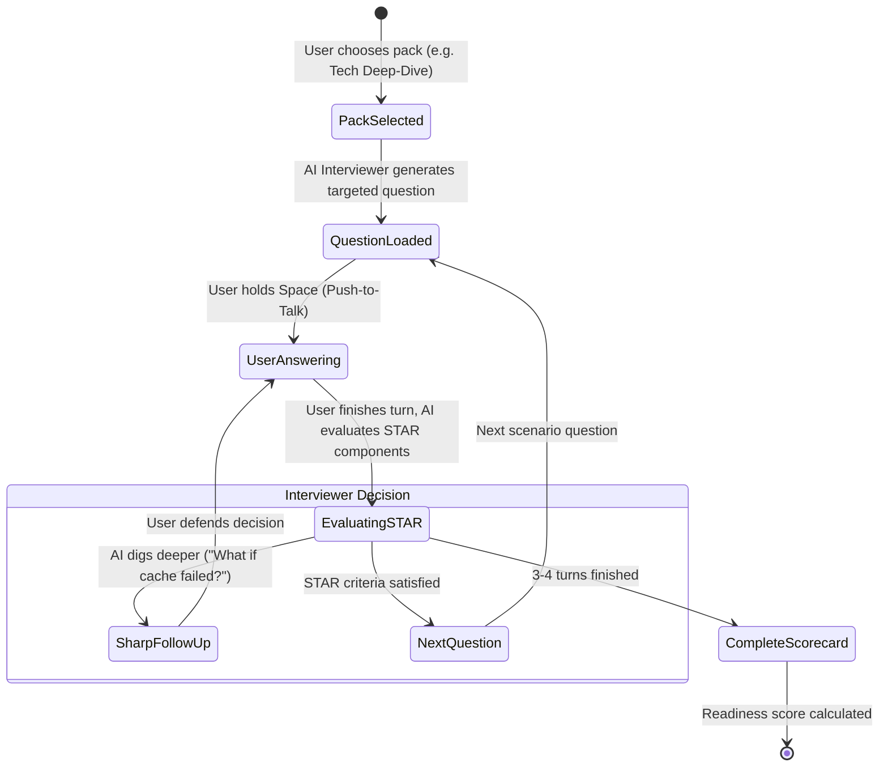

# Screen Prototype 04: The Hot Seat — Interview Mode (`/interview`)

The Hot Seat is the professional pressure chamber of English Trainer. While Daily Practice and Conversation Mode build spontaneous general fluency, The Hot Seat prepares B1 learners for **high-stakes technical, system design, HR, and behavioral interviews**.

---

## 1. Screen Objectives

1. **Realistic Interview Pressure**: Realistic follow-ups instead of a static questionnaire.
2. **4 Specialized Interview Packs**:
   - **HR / Screening**: Self-intro, career motivation, compensation, strengths & weaknesses.
   - **Technical Deep-Dive**: Past projects, debugging incidents, architecture choices, databases, API design.
   - **System Design**: Scale, latency/throughput trade-offs, bottlenecks, data consistency, failure modes.
   - **Behavioral (STAR)**: Conflict, deadlines, leadership, mistakes, cross-functional collaboration.
3. **Live STAR Structure Tracker**: Visual progress indicator showing whether the speaker covered **S**ituation, **T**ask, **A**ction, and **R**esult (with measurable impact).
4. **Gentle Timekeeper**: Optional 60–120s answer timer preventing rambling without creating panic.
5. **Interview Readiness Scorecard**: Measures professional delivery separately from general CEFR language level (conciseness, technical depth, trade-off phrasing).

---

## 2. Visual Wireframe (ASCII Layout)

```text
┌──────────────────────────────────────────────────────────────────────────────────────────────────────────────────┐
│ 🔴 🟡 🟢  English Trainer  >  The Hot Seat (Interview)             [ 🌱 Mini Eva: Level 3 ]   [ ⚙️ Settings ]     │
├─────────────────────────┬────────────────────────────────────────────────────────────────────────────────────────┤
│  NAVIGATION             │  INTERVIEW PACK SELECTOR: [ HR ]  [ Tech Deep-Dive ▾ ]  [ System Design ]  [ STAR ]    │
│                         │  Company: Core Banking Infrastructure  │  Interviewer: David (Staff Architect)         │
│  🎙️ Practice            ├────────────────────────────────────────────────────────────────────────────────────────┤
│  💬 Conversation        │  INTERVIEW CANVAS & FOLLOW-UP ENGINE                                                   │
│  🎯 Coach Mode          │                                                                                        │
│  💼 Hot Seat (Active)   │  ┌─ INTERVIEWER QUESTION ────────────────────────────────────────────────────────────┐ │
│  ⚡ Drills              │  │  👨‍💼 David (Staff Architect):                                                        │ │
│  ─────────────────────  │  │  "Tell me about a time when a production service you owned suffered a severe    │ │
│  🧠 Memory       [18]   │  │   performance degradation. How did you diagnose and resolve the bottleneck?"     │ │
│  📊 Progress            │  │                                                                [ 🔈 Replay ]      │ │
│                         │  └───────────────────────────────────────────────────────────────────────────────────┘ │
│                         │                                                                                        │
│                         │  ┌─ LIVE STAR FRAMEWORK TRACKER ─────────────────────────────────────────────────────┐ │
│                         │  │  [✓ S: Situation]  [✓ T: Task]  [▶ A: Action (In progress)]  [○ R: Result (Metrics)]│ │
│                         │  │  Progress: 50% · Suggested focus: "State exact metric impact (e.g. latency dropped)"│ │
│                         │  └───────────────────────────────────────────────────────────────────────────────────┘ │
│                         │                                                                                        │
│                         │  ┌─ TRANSCRIPT & STREAM ─────────────────────────────────────────────────────────────┐ │
│                         │  │  🗣️ You (Attempt: 52s / 90s target):                                              │ │
│                         │  │  "Last year, our transaction processing API latency spiked from 50ms to 2.4       │ │
│                         │  │   seconds during Black Friday. My responsibility was to identify the root cause...│ │
│                         │  └───────────────────────────────────────────────────────────────────────────────────┘ │
│                         │                                                                                        │
│                         │  ┌─ PUSH-TO-TALK & PRESSURE TIMER ───────────────────────────────────────────────────┐ │
│                         │  │   ⏱️ 0:52 / 1:30   ██████████████████░░░░░░░░░░░   (Optimal concise window)        │ │
│                         │  │                    [ 🎙️ HOLD SPACE TO ANSWER DAVID ]                              │ │
│                         │  │   Target Vocabulary: "bottleneck" · "connection pool" · "p99 latency" · "mitigate"  │ │
│                         │  └───────────────────────────────────────────────────────────────────────────────────┘ │
├─────────────────────────┴────────────────────────────────────────────────────────────────────────────────────────┤
│ 🎙️ PTT Ready · Local Whisper Metal (12ms)                                      [ Hold Space to answer David ]  │
└──────────────────────────────────────────────────────────────────────────────────────────────────────────────────┘
```

---

## 3. Component Hierarchy (HeroUI v3)

```text
TheHotSeatView
├── AppSidebar
└── InterviewCanvas
    ├── PackSelectorTabs (HeroUI Tabs.List / Tabs.Tab)
    │   ├── Tab (HR & Screening)
    │   ├── Tab (Technical Deep-Dive - Active)
    │   ├── Tab (System Design)
    │   └── Tab (Behavioral / STAR)
    │
    ├── InterviewerContextBar
    │   ├── InterviewerAvatar (Staff Architect persona)
    │   ├── Role & ScenarioChip ("Fintech Core Banking · Senior Backend")
    │   └── EndInterviewButton (Button variant="light")
    │
    ├── QuestionCard (Card)
    │   ├── Header: QuestionCategory ("Incident Post-Mortem & Diagnosis")
    │   ├── Body: Spoken prompt text
    │   └── AudioReplayButton
    │
    ├── StarTrackerWidget (Card / Progress)
    │   ├── StarStepsGrid
    │   │   ├── StarBadge (S: Situation - Completed)
    │   │   ├── StarBadge (T: Task - Completed)
    │   │   ├── StarBadge (A: Action - Active)
    │   │   └── StarBadge (R: Result - Pending, needs measurable metrics)
    │   └── Progress (STAR completeness percentage)
    │
    ├── LiveTranscriptBubble (User answer streaming)
    │
    ├── PushToTalkAndTimerHUD (Card)
    │   ├── AnswerTimerProgressBar (Color changes: Green <60s, Amber 60-90s, Red >120s)
    │   ├── PttButton (Large Spacebar interactive button)
    │   └── TargetVocabularyChips (e.g. "bottleneck", "trade-off", "p99 latency")
    │
    └── InterviewReadinessModal (HeroUI Modal.Dialog on completion)
        ├── ReadinessRadar / Score (STAR completeness, Conciseness, Technical collocations)
        ├── SharperFollowUpReview
        └── PhrasesToSaveToMemory
```

---

## 4. State Transitions


