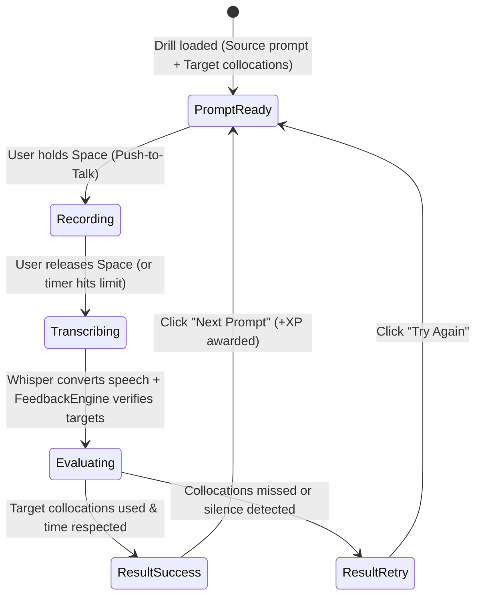

# Screen Prototype 05: Skill Builders / Drills (`/drills`)

Skill Builders are high-intensity, bite-sized speaking gym exercises (30–90 seconds each). Unlike full conversations or complete interview simulations, drills isolate and train specific vocal bottlenecks:
**Overcoming hesitation, rapid paraphrasing, elevator pitching, simplifying complex ideas, and structured storytelling.**

---

## 1. Screen Objectives

1. **Focused Muscle Isolation**: Train one speaking skill at a time without the cognitive burden of a full multi-turn dialogue.
2. **5 High-Impact Drill Types**:
   - **30-Second Elevator Pitch**: High-impact self-intro or project summary with strict 30s countdown.
   - **Paraphrase Challenge**: Express a simple B1 sentence in 2 different B2 structures.
   - **Explain Like I'm 10 (Simplifier)**: Strip away technical jargon and explain complex concepts in plain English.
   - **STAR Story Vocalizer**: Rapidly vocalize one phase of a STAR story with clear transition signposts.
   - **Rapid Unexpected Question**: 5-second countdown followed by 45s of spontaneous speaking to train panic recovery.
3. **Instant Objective Feedback**: Clear pass/fail or rating criteria (Did you use target collocations? Did you beat the timer? Did you eliminate fillers?).
4. **Fast Replayability**: "Next Challenge" button immediately serves a new prompt in the same category.

---

## 2. Visual Wireframe (ASCII Layout)

```text
┌──────────────────────────────────────────────────────────────────────────────────────────────────────────────────┐
│ 🔴 🟡 🟢  English Trainer  >  Skill Drills                         [ 🌱 Mini Eva: Level 3 ]   [ ⚙️ Settings ]     │
├─────────────────────────┬────────────────────────────────────────────────────────────────────────────────────────┤
│  NAVIGATION             │  DRILL SELECTOR: [ ⚡ 30s Pitch ] [ 🔄 Paraphrase (Active) ] [ 👶 Simplifier ] [ 📐 STAR ]│
│                         │  Category Streak: 4 completed today · Daily Drill Bonus: +50 XP                        │
│  🎙️ Practice            ├────────────────────────────────────────────────────────────────────────────────────────┤
│  💬 Conversation        │  DRILL WORKBENCH: Paraphrase Challenge                                                 │
│  🎯 Coach Mode          │                                                                                        │
│  💼 The Hot Seat        │  ┌─ SOURCE B1 SENTENCE ──────────────────────────────────────────────────────────────┐ │
│  ⚡ Drills (Active)     │  │  Original idea to upgrade:                                                        │ │
│  ─────────────────────  │  │  “Our app was very slow, so we used caching to make it quick.”                   │ │
│  🧠 Memory       [18]   │  │                                                                                   │ │
│  📊 Progress            │  │  🎯 Challenge: Rephrase using at least one of these collocations:                 │ │
│                         │  │     [ "latency bottleneck" ]   [ "significant performance boost" ]   [ "whereas" ]│ │
│                         │  └───────────────────────────────────────────────────────────────────────────────────┘ │
│                         │                                                                                        │
│                         │  ┌─ RECORDING CANVAS & TIMER ────────────────────────────────────────────────────────┐ │
│                         │  │   ⏱️ 0:18 / 0:30     ████████████████░░░░░░░░░░   (Time remaining: 12s)            │ │
│                         │  │                                                                                   │ │
│                         │  │                     [ 🎙️ HOLD SPACE TO SPEAK YOUR PARAPHRASE ]                    │ │
│                         │  │                                                                                   │ │
│                         │  │   Release Space when finished answering. Target: 1 natural sentence.              │ │
│                         │  └───────────────────────────────────────────────────────────────────────────────────┘ │
│                         │                                                                                        │
│                         │  ┌─ INSTANT RESULT & EVALUATION ─────────────────────────────────────────────────────┐ │
│                         │  │  🎉 Score: Outstanding B2 Upgrade (+20 XP)                                        │ │
│                         │  │  Your answer:                                                                     │ │
│                         │  │  “To address our latency bottleneck, we introduced caching, which delivered a     │ │
│                         │  │   significant performance boost.”                                                 │ │
│                         │  │                                                                                   │ │
│                         │  │  ✓ Collocations Used: "latency bottleneck", "significant performance boost"       │ │
│                         │  │  ✓ Structure: Purpose clause ("To address...") eliminates repetitive "so we..."  │ │
│                         │  │                                                                                   │ │
│                         │  │  [ ⭐ Save to Memory ]   [ 🔄 Try Another Paraphrase ]   [ ➔ Next Drill Type ]   │ │
│                         │  └───────────────────────────────────────────────────────────────────────────────────┘ │
├─────────────────────────┴────────────────────────────────────────────────────────────────────────────────────────┤
│ 🎙️ PTT Active · Local Whisper Metal (12ms)                                    [ Press Space to record drill ] │
└──────────────────────────────────────────────────────────────────────────────────────────────────────────────────┘
```

---

## 3. Component Hierarchy (HeroUI v3)

```text
DrillsView
├── AppSidebar
└── DrillCanvas
    ├── DrillCategoryTabs (HeroUI Tabs.List)
    │   ├── Tab (30s Pitch)
    │   ├── Tab (Paraphrase Challenge - Active)
    │   ├── Tab (Explain Like I'm 10)
    │   ├── Tab (STAR Vocalizer)
    │   └── Tab (Rapid Surprise)
    │
    ├── DrillHeaderCard (Card)
    │   ├── Header: Category Title + DailyDrillStreak ("4 Drills Done")
    │   └── Body: Source Prompt / Task description
    │
    ├── TargetCollocationsShelf (HeroUI Chip list)
    │   ├── Chip ("latency bottleneck")
    │   ├── Chip ("significant performance boost")
    │   └── Chip ("whereas")
    │
    ├── PacingAndRecordingHUD (Card)
    │   ├── CountdownProgressBar (Color transitions: Green → Amber → Red)
    │   └── PushToTalkButton (Button with microphone icon and recording state)
    │
    ├── InstantEvaluationCard (Card)
    │   ├── Header: ScoreBadge ("Outstanding B2 Upgrade") + XpAwardChip
    │   ├── Body: Transcript display with highlighted adopted collocations
    │   ├── ImprovementChecklist (Structure variety check, filler check, latency check)
    │   └── Footer: ActionRow
    │       ├── SavePhrasesButton
    │       ├── NextPromptButton ("Next Paraphrase ➔")
    │       └── SwitchCategoryButton
    │
    └── AudioStatusBar
```

---

## 4. State Machine for a Drill Attempt


