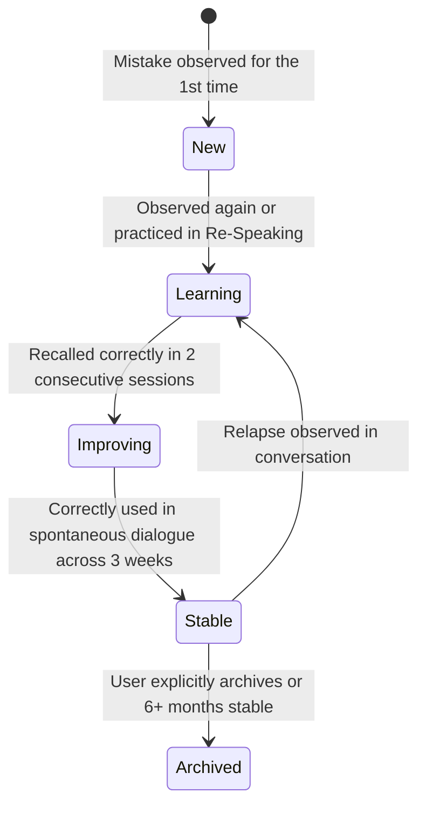

# Screen Prototype 06: Learning Memory (`/memory`)

Learning Memory is the long-term knowledge retention core of English Trainer. It evolves beyond a simple mistake list into a structured spaced-repetition system comprising the **Mistakes Vault** and **Phrase Memory**.

---

## 1. Screen Objectives

1. **Dual Knowledge Structure**:
   - **Mistakes Vault**: Tracks recurring errors across 9 categories (Articles, Prepositions, Tense, Collocations, Slavicisms/Literal translations, Word Order, Fillers, Weak Vocab, Coherence).
   - **Phrase Memory**: Collects active B2 expressions and idioms discovered during conversations.
2. **5-Stage Mastery Lifecycle**:
   Every mistake moves through: `new` → `learning` → `improving` → `stable` → `archived`.
3. **Adaptive Spaced Repetition (SRS)**:
   A simplified SM-2 algorithm schedules discrete voice recall tests for due items before they fade from memory.
4. **Interactive Flashcard Mode**:
   A focused 2-minute voice retrieval flow: the user sees a B1 idea or Russian prompt, speaks the target B2 collocation, and updates the card's stability.

---

## 2. Visual Wireframe (ASCII Layout)

```text
┌──────────────────────────────────────────────────────────────────────────────────────────────────────────────────┐
│ 🔴 🟡 🟢  English Trainer  >  Learning Memory                      [ 🌱 Mini Eva: Level 3 ]   [ ⚙️ Settings ]     │
├─────────────────────────┬────────────────────────────────────────────────────────────────────────────────────────┤
│  NAVIGATION             │  MEMORY TABS: [ 📚 Mistakes Vault (12) ]  [ ⭐ Phrase Cards (6) ]   [ 🧠 Start Review (4) ]│
│                         │  Stats: 18 Tracked Items · 4 Due Today · 5 Moved to 'Stable' this month                │
│  🎙️ Practice            ├────────────────────────────────────────────────────────────────────────────────────────┤
│  💬 Conversation        │  FILTERS: [ Search keywords... 🔍 ]  Category: [ All ▾ ]  Status: [ All Active ▾ ]     │
│  🎯 Coach Mode          │                                                                                        │
│  💼 The Hot Seat        │  ┌─ MISTAKE VAULT TABLE / CARDS ─────────────────────────────────────────────────────┐ │
│  ⚡ Drills              │  │  ORIGINAL PHRASE             B2 CORRECTION         CATEGORY     STATUS      HISTORY  │ │
│  ─────────────────────  │  ├───────────────────────────────────────────────────────────────────────────────────┤ │
│  🧠 Memory (Active)[18] │  │  "the minus was that..."   ➔ "the main drawback"  [SLAVICISM]  [improving] 3x/2x ✓  │ │
│  📊 Progress            │  │  "more fast"               ➔ "significantly faster"[GRAMMAR]    [stable]    4x/4x ✓  │ │
│  ⚙️ Settings            │  │  "depend of the team"      ➔ "depend on the team"  [PREPOSITION][learning]  2x/0x ⏳ │ │
│                         │  │  "I have seen this yesterday"➔ "I saw this yesterday" [TENSE]      [learning]  3x/1x ⏳ │ │
│                         │  └───────────────────────────────────────────────────────────────────────────────────┘ │
│                         │                                                                                        │
│                         │  ┌─ ACTIVE FLASHCARD POPUP (When clicking "Start Review") ───────────────────────────┐ │
│                         │  │   Card 1 of 4 · Due for Spaced Recall today                                        │ │
│                         │  │   Prompt: "Replace the literal translation 'минус был в том' with native B2"       │ │
│                         │  │   [ 🎙️ Hold Space to Speak Your Recall ] ➔ Target: "the main drawback"             │ │
│                         │  │   Result: Recalled correctly! Interval increased to 6 days. (+15 XP)               │ │
│                         │  └───────────────────────────────────────────────────────────────────────────────────┘ │
├─────────────────────────┴────────────────────────────────────────────────────────────────────────────────────────┤
│ 🎙️ PTT Ready · SQLite DB: 18 items · 4 due today                                  [ Press Space to record ]    │
└──────────────────────────────────────────────────────────────────────────────────────────────────────────────────┘
```

---

## 3. Component Hierarchy (HeroUI v3)

```text
LearningMemoryView
├── AppSidebar
└── MemoryCanvas
    ├── TopMemoryHeader
    │   ├── MemoryTabs (HeroUI Tabs.List)
    │   │   ├── Tab (Mistakes Vault - 12)
    │   │   ├── Tab (Phrase Memory - 6)
    │   │   └── Tab (Due Spaced Review - 4 Due)
    │   └── StartReviewButton (Button color="primary", "Start 2-Min Voice Review")
    │
    ├── FilterBar (HeroUI Input + Select)
    │   ├── SearchInput (Search by original phrase or keyword)
    │   ├── CategoryFilterSelect (All, Slavicisms, Prepositions, Grammar, Collocations)
    │   └── StatusFilterSelect (All, New, Learning, Improving, Stable)
    │
    ├── MistakesTable (HeroUI Table)
    │   ├── TableHeader (Original, Correction, Category, Status, Observed / Fixed, Next Review, Actions)
    │   └── TableBody (List of Mistake records with Chip status badges and Expandable Accordion rows)
    │
    └── SpacedRecallModal (HeroUI Modal.Dialog)
        ├── Modal.Header: "Voice Recall Drill (Item 1 of 4)"
        ├── Modal.Body:
        │   ├── PromptCard (B1 sentence or translation cue)
        │   ├── PttRecallButton ("Hold Space to Speak Corrected Phrase")
        │   └── ComparisonResult (Side-by-side verification and stability interval increase)
        └── Modal.Footer: "Next Due Phrase ➔"
```

---

## 4. State Transitions for Item Lifecycle


