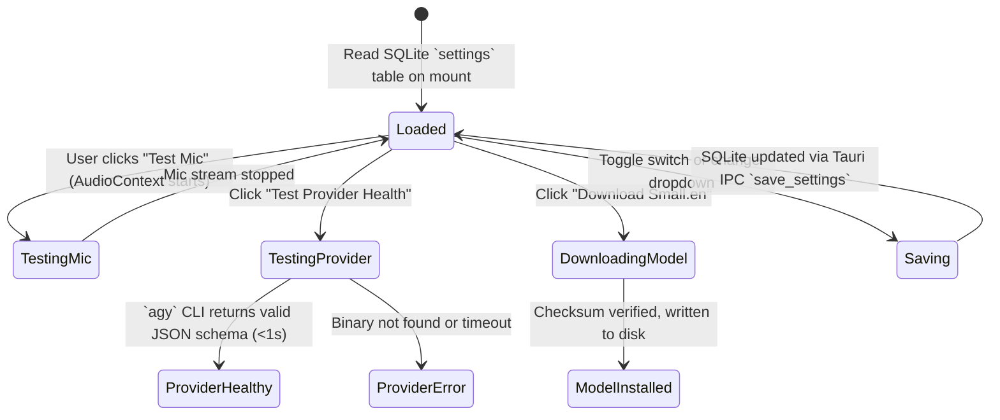

# Screen Prototype 08: Settings & Hardware (`/settings`)

The Settings screen provides transparency and complete user control over local macOS hardware, speech models, AI providers, ambient companion frequency, and strict privacy guarantees.

---

## 1. Screen Objectives

1. **Hardware Transparency**: Verify microphone input levels, discover system TTS voices, and test Whisper Metal acceleration locally.
2. **Local-First STT Model Management**: Clear download, disk usage, and benchmark status for Whisper models (`Base.en`, `Small.en`, `Medium.en`).
3. **Replaceable AI Provider Health**: Diagnostics for the Antigravity CLI (`agy`) bridge, including execution path, latency check, and model tier assignments.
4. **Customizable Ambient Practice**: User control over daily micro-quest limits, quiet hours, and launch-at-login behavior (always opt-in).
5. **Strict Privacy by Default**: Toggle raw audio retention (disabled by default), inspect local SQLite data, or perform a 1-click database wipe.

---

## 2. Visual Wireframe (ASCII Layout)

```text
┌──────────────────────────────────────────────────────────────────────────────────────────────────────────────────┐
│ 🔴 🟡 🟢  English Trainer  >  Settings                             [ 🌱 Mini Eva: Level 3 ]   [ 💾 Save Changes ] │
├─────────────────────────┬────────────────────────────────────────────────────────────────────────────────────────┤
│  NAVIGATION             │  SETTINGS TABS: [ 🎙️ Audio & Voice ] [ ⚡ Whisper STT ] [ 🤖 LLM (agy) ] [ 🔒 Privacy ] │
│                         │                                                                                        │
│  🎙️ Practice            │  ┌─ AUDIO INPUT (MICROPHONE) ────────────────────────────────────────────────────────┐ │
│  💬 Conversation        │  │  Input Device: [ MacBook Pro Microphone (Built-in) ▾ ]                            │ │
│  🎯 Coach Mode          │  │  Live Mic Test:  [ 🎙️ Test Mic ]  ███████████████░░░░░░░░  -12 dB (Optimal level)   │ │
│  💼 The Hot Seat        │  │  Normalization: 16 kHz Mono PCM (Web Audio API)                                   │ │
│  ⚡ Drills              │  │  Push-to-Talk Shortcut: [ Spacebar ▾ ]  (Alternative: fn / Right Option)           │ │
│  ─────────────────────  │  └───────────────────────────────────────────────────────────────────────────────────┘ │
│  🧠 Memory       [18]   │                                                                                        │
│  📊 Progress            │  ┌─ SYSTEM SPEECH SYNTHESIS (TTS) ───────────────────────────────────────────────────┐ │
│  ⚙️ Settings (Active)   │  │  System Voice: [ Daniel (English - UK) ▾ ]  [ ▶ Test Voice ]                       │ │
│                         │  │  Playback Speed: 1.00x  [────●──────────] (0.85x – 1.20x)                         │ │
│                         │  │  [✓] Automatically speak AI turns in Conversation and Coach modes                 │ │
│                         │  └───────────────────────────────────────────────────────────────────────────────────┘ │
│                         │                                                                                        │
│                         │  ┌─ LOCAL WHISPER STT ENGINE ────────────────────────────────────────────────────────┐ │
│                         │  │  Active Model: Base.en (142 MB) · Hardware: Metal (Apple Silicon GPU ⚡)          │ │
│                         │  │  Status: Installed & Ready · Typical Turn Latency: 14ms                           │ │
│                         │  │  [ Download Small.en (466 MB) for higher accuracy ]                               │ │
│                         │  └───────────────────────────────────────────────────────────────────────────────────┘ │
│                         │                                                                                        │
│                         │  ┌─ AI PROVIDER (Antigravity CLI) ───────────────────────────────────────────────────┐ │
│                         │  │  Binary Path: /opt/homebrew/bin/agy  [ 🔄 Test Provider Health ]                   │ │
│                         │  │  Status: 🟢 Connected · Schema validation OK · Scratch dir isolated               │ │
│                         │  └───────────────────────────────────────────────────────────────────────────────────┘ │
│                         │                                                                                        │
│                         │  ┌─ PRIVACY & DATA GUARANTEE ────────────────────────────────────────────────────────┐ │
│                         │  │  [○] Retain raw audio recordings (Disabled by default: audio is discarded)        │ │
│                         │  │  [✓] Store transcripts and metrics in local SQLite (~4.2 MB used)                 │ │
│                         │  │  [ Export Learning Data (JSON) ]   [ ⚠️ Delete All History & Reset ]             │ │
│                         │  └───────────────────────────────────────────────────────────────────────────────────┘ │
├─────────────────────────┴────────────────────────────────────────────────────────────────────────────────────────┤
│ 🎙️ PTT Ready · Local Whisper Metal (12ms)                                     [ Settings saved to local SQLite]│
└──────────────────────────────────────────────────────────────────────────────────────────────────────────────────┘
```

---

## 3. Component Hierarchy (HeroUI v3)

```text
SettingsView
├── AppSidebar
└── SettingsCanvas
    ├── SettingsTabs (HeroUI Tabs.List)
    │   ├── Tab (Audio & Voice)
    │   ├── Tab (Whisper STT Engine)
    │   ├── Tab (LLM Provider agy)
    │   ├── Tab (Ambient Companion)
    │   └── Tab (Privacy & Security)
    │
    ├── AudioSection (Card)
    │   ├── Select (Microphone device picker)
    │   ├── MicLevelMeter (Live reactive canvas/progress bar)
    │   ├── Select (Push-to-Talk keyboard shortcut)
    │   ├── Select (macOS TTS voice selector)
    │   └── Slider (TTS playback rate 0.85x – 1.20x)
    │
    ├── WhisperSection (Card)
    │   ├── MetalStatusBadge (Chip color="success": "Metal GPU Active")
    │   ├── ModelCardsGrid
    │   │   ├── ModelCard (Base.en - Installed, Active)
    │   │   ├── ModelCard (Small.en - Downloadable, 466MB)
    │   │   └── ModelCard (Medium.en - Downloadable, 1.5GB)
    │   └── BenchmarkButton ("Run 5s Inference Benchmark")
    │
    ├── ProviderSection (Card)
    │   ├── Input (Binary path: /opt/homebrew/bin/agy)
    │   ├── HealthStatusChip (Chip color="success": "Operational 410ms")
    │   └── TestConnectionButton
    │
    ├── AmbientSection (Card)
    │   ├── Switch (Launch at login minimized in menu bar)
    │   ├── Slider (Daily micro-quest maximum: 1 – 3 prompts)
    │   └── TimePickerRow (Quiet hours: 21:00 – 09:00)
    │
    └── PrivacySection (Card)
        ├── Switch (Raw audio retention - Disabled by default)
        ├── Switch (Local transcript history)
        ├── Button (Export data JSON)
        └── Button (color="danger", "Delete All Local Data")
```

---

## 4. State Machine for Settings Updates


