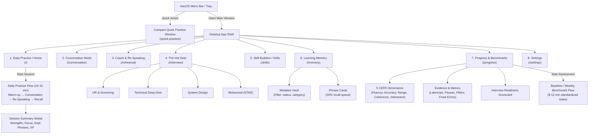

# Navigation Map & Information Architecture

This document defines the user interface architecture, navigation system, screen hierarchy, and HeroUI component mapping for the **English Trainer** macOS desktop application.

---

## 1. Design & Platform Philosophy

- **macOS-First Desktop Experience**: Clean desktop layout with native macOS vibes (translucency/vibrancy, SF Pro typography, keyboard shortcuts, tray integration, compact secondary window).
- **HeroUI (v3) + Tailwind CSS v4**: Built on accessible React Aria primitives with compound components (`Card.Header`, `Card.Body`, `Modal.Dialog`, `Tabs`, `Button`, `Chip`, `Progress`).
- **Core Loop Centricity**: Every screen either initiates the speaking loop, reinforces re-speaking, or visualizes retained memory and evidence-based progress.
- **Low Cognitive Overhead**: The user should never wonder what to do next. The primary CTA on launch is always a single click: **"Start 10–15 Minute Practice"**.
- **State Machine Driven**: All speaking canvases implement the strict lifecycle:
  `idle` → `recording` (Push-to-Talk) → `transcribing` (local Whisper) → `thinking` (LLM) → `speaking` (TTS) → `feedback` (async evaluation) → `re-speaking` → `summary`.

---

## 2. Global Application Shell Layout

```text
┌────────────────────────────────────────────────────────────────────────────────────────┐
│  🔴 🟡 🟢   English Trainer                   [ Mini Eva: Lv.3 🌱 240 XP ]  [⚙️ Settings] │
├───────────────────┬────────────────────────────────────────────────────────────────────┤
│ 🎙️ Practice (Home) │                                                                    │
│ 💬 Conversation   │                                                                    │
│ 🎯 Coach Mode     │                      ACTIVE SCREEN CONTENT                         │
│ 💼 The Hot Seat   │                                                                    │
│ ⚡ Drills         │                                                                    │
│ ───────────────── │                                                                    │
│ 🧠 Memory (18 due)│                                                                    │
│ 📊 Progress       │                                                                    │
├───────────────────┴────────────────────────────────────────────────────────────────────┤
│ 🔈 Audio: Built-in Mic (Ready)  │  Whisper: Base.en (Metal ⚡)  │  [ Hold Space to Speak ]│
└────────────────────────────────────────────────────────────────────────────────────────┘
```

### Key Elements of the Shell:
1. **Window Header / Title Bar**:
   - macOS Traffic Lights (left).
   - Breadcrumbs / Active Context title.
   - **Mini Eva status widget**: avatar, current expression, level & daily XP momentum, quick micro-quest hint.
   - Settings quick-access button.
2. **Primary Sidebar Navigation**:
   - Fixed width (240px), collapsible if desired.
   - Group 1: **Daily Practice & Modes** (Practice Home, Conversation, Coach / Rehearsal, The Hot Seat / Interview, Drills).
   - Group 2: **Learning & Analytics** (Learning Memory with badge of due items, Progress & Benchmarks).
3. **Global Push-to-Talk HUD / Audio Status Footer**:
   - Audio input monitor & Whisper engine status.
   - Global keyboard hint (`Space` or `fn` key).
   - Persistent volume / mic activity meter.

---

## 3. Screen Hierarchy & Navigation Map



---

## 4. Main Screens Breakdown

| Screen / Route | Primary Purpose | Key HeroUI Components | Core Interactions |
| :--- | :--- | :--- | :--- |
| **1. Daily Practice / Home** (`/`) | Default entry point. Single click starts recommended 10–15 min session. Shows today's momentum & Mini Eva quest. | `Button` (Primary Large), `Card`, `Progress`, `Chip`, `Avatar`, `Badge` | "Start Daily Practice", review quick stats, see next micro-quest. |
| **2. Coach & Re-Speaking** (`/rehearsal`) | Deliberate practice with immediate 1–3 focused corrections, B1→B2 rewrites, and instant side-by-side re-speaking comparison. | `Card`, `Accordion`, `Chip` (severity/category), `Button` ("Try Again"), `Snippet` / `DiffView` | Push-to-Talk, review diff, record second attempt, see target fixed confirmation. |
| **3. Conversation Mode** (`/conversation`) | Spontaneous fluency practice. Minimal interruptions; feedback collected silently and shown after session. | `Avatar`, `ScrollShadow`, `Button`, `Chip`, `Slider` (TTS speed) | Flowing dialogue, live transcript, push-to-talk turn-taking, subtle scaffolding hints. |
| **4. The Hot Seat (Interview)** (`/interview`) | Professional pressure training with dynamic follow-up questions across 4 technical/HR packs. | `Card`, `Tabs`, `Badge`, `Chip`, `Progress` (STAR completeness indicator) | Select pack/scenario, answer with timer, handle challenging follow-up questions. |
| **5. Skill Builders / Drills** (`/drills`) | Focused rapid-fire mini-workouts: STAR vocalizer, 30s pitch, paraphrase, collocation drill. | `Card`, `Button`, `Timer`, `Tooltip` | Fast timed prompts, targeted phrase practice. |
| **6. Learning Memory** (`/memory`) | Long-term knowledge bank: Mistake Vault + Spaced Repetition Phrase Cards. | `Tabs`, `Table`, `Chip`, `Input` (search), `Dropdown`, `Modal` | Review due phrases (SRS), inspect mistake history, retire mastered collocations. |
| **7. Progress & Benchmarks** (`/progress`) | Evidence-based progress across 5 dimensions, local metrics trends, benchmark comparison. | `Card`, `Progress`, `Tabs`, `Table`, `Badge`, `Tooltip` | View radar chart / dimension breakdown, inspect pause/latency trends, start benchmark. |
| **8. Settings** (`/settings`) | Local hardware, STT models, LLM provider, ambient schedule, and strict privacy controls. | `Tabs`, `Switch`, `Select`, `Slider`, `Input`, `Alert` | Configure microphone, test TTS voice, manage Whisper models, verify `agy` CLI, toggle privacy. |
| **9. Quick Practice Window** (`/quick-practice`) | Compact (400x500) desktop pop-up for 20–90 second ambient micro-quests triggered from tray or hotkey. | `Card`, `Button` (Push-to-Talk), `Chip`, `Progress` | Instant answer, micro-feedback, XP award, auto-close. |
| **10. Session Summary** (Overlay/Modal) | Presented after every completed session with 1 improvement, 1 focus, and phrases saved. | `Modal.Dialog`, `Card`, `Badge`, `Button`, `Confetti/XP counter` | Review turn highlights, add phrases to Memory, finish session. |

---

## 5. HeroUI Component Mapping Strategy

HeroUI v3 components with Tailwind CSS v4 styling map naturally to our requirements:

```text
HeroUI Component     →  Application Usage
─────────────────────────────────────────────────────────────────────────────
Button               →  Push-to-Talk trigger, "Start Practice", "Try Again" re-speak
Card (.Header/.Body) →  Coaching cards, scenario packs, mistake records, metrics
Chip                 →  CEFR tags (B1/B2), mistake categories, SRS status, priority
Modal (.Dialog)      →  Session summary, baseline onboarding, confirmation dialogs
Progress             →  Session timeline (warm-up/dialogue/re-speak), fluency metrics
Tabs (.List/.Panel)  →  Memory (Mistakes vs Phrases), Settings sections, Interview packs
Accordion            →  Detailed grammar explanations, Slavicism breakdown
Avatar               →  Mini Eva emotional state, AI interlocutor personas
Slider               →  TTS playback rate (0.85x – 1.20x), ambient frequency
Switch               →  Audio retention toggle, autostart, notification opt-in
Table                →  Learning memory list, historical benchmark comparison
Input / Select       →  Microphone device picker, system voice selector, search
Alert / Callout      →  Hardware warning, microphone permissions, Slavicism alert
```

---

## 6. Prototyping Roadmap in `docs/ui/`

We will prototype each screen in detailed specification and layout files in `docs/ui/`:

1. `01_DAILY_PRACTICE_DASHBOARD.md` — The home screen, daily momentum, quick launch, and session step overview.
2. `02_COACH_AND_RESPEAKING.md` — The core deliberate practice loop: feedback card, B1→B2 rewrite, and Attempt 1 vs. Attempt 2 comparison.
3. `03_CONVERSATION_MODE.md` — Spontaneous speech UI, silent feedback queue, scaffolding controls (Full/Partial/None).
4. `04_THE_HOT_SEAT_INTERVIEW.md` — The 4 interview packs, pressure timer, STAR structure tracker, follow-up handling.
5. `05_LEARNING_MEMORY.md` — Mistakes Vault (with status lifecycles) & Phrase Memory (SRS cards).
6. `06_PROGRESS_AND_BENCHMARKS.md` — 5-dimension radar, evidence-based metrics charts, and baseline assessment.
7. `07_AMBIENT_COMPANION_QUICK_PRACTICE.md` — macOS menu bar companion & compact 20–90 second micro-quest window.
8. `08_SETTINGS_AND_HARDWARE.md` — Audio setup, Whisper local model manager, `agy` LLM provider health check, privacy controls.
