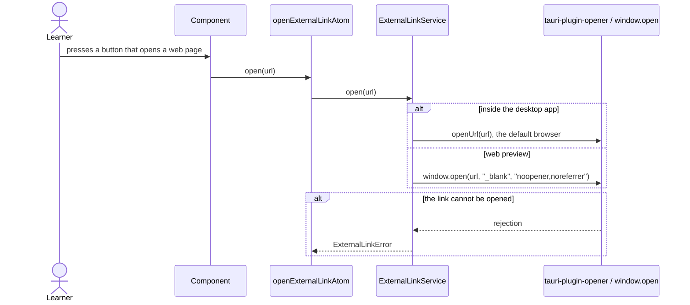

# External link flow

```mermaid
sequenceDiagram
    actor Learner
    participant Component
    participant Atoms as openExternalLinkAtom
    participant Service as ExternalLinkService
    participant Opener as tauri-plugin-opener / window.open

    Learner->>Component: presses a button that opens a web page
    Component->>Atoms: open(url)
    Atoms->>Service: open(url)
    alt inside the desktop app
        Service->>Opener: openUrl(url), the default browser
    else web preview
        Service->>Opener: window.open(url, "_blank", "noopener,noreferrer")
    end
    alt the link cannot be opened
        Opener-->>Service: rejection
        Service-->>Atoms: ExternalLinkError
    end
```
