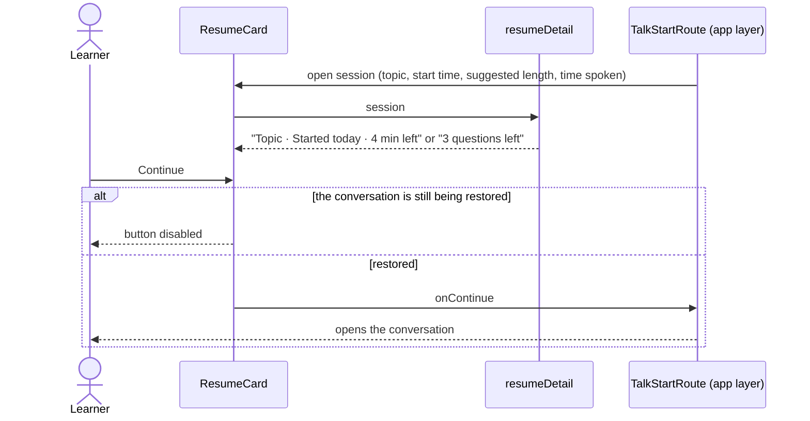

# Session resume flow

The "Continue" card shown instead of the setup choices while a conversation is open (restored after a
restart or left through the sidebar).

```mermaid
sequenceDiagram
    actor Learner
    participant Card as ResumeCard
    participant Helper as resumeDetail
    participant App as TalkStartRoute (app layer)

    App->>Card: open session (topic, start time, suggested length, time spoken)
    Card->>Helper: session
    Helper-->>Card: "Topic · Started today · 4 min left" or "3 questions left"
    Learner->>Card: Continue
    alt the conversation is still being restored
        Card-->>Learner: button disabled
    else restored
        Card->>App: onContinue
        App-->>Learner: opens the conversation
    end
```
